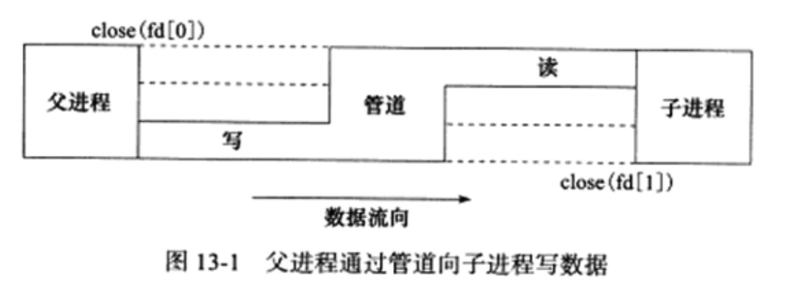
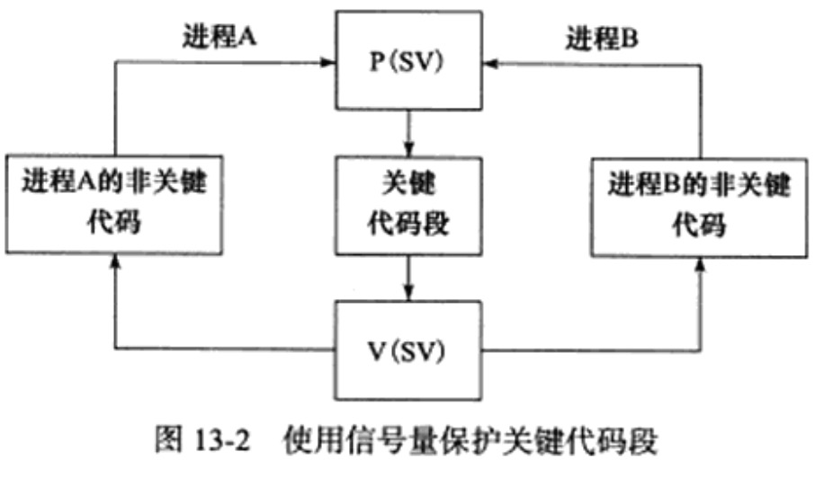

# 多进程编程

进程是Linux操作系统环境的基础，它控制着系统上几乎所有的活动。本章从系统程序员的角度来讨论Linux多进程编程，包括以下内容：

* 复制进程映像的fork系统调用和替换进程映像
* 僵尸进程以及如何避免僵尸进程
* 进程间通信(IPC)最简单的方式：管道
* 3种SystemV进程间通信方式：信号量、消息队列和共享内存
* 在进程间传递文件描述符的通用方法：通过UNIX本地域socket传递特殊的辅助数据

## fork系统调用

Linux下创建新进程的系统调用是`fork`。其定义如下：
```
#include <sys/types.h>
#include <unistd.h>
pid_t fork(void);
```
该函数的每次调用都返回两次，在父进程中返回的是子进程的PID，在子进程中则返回0。该返回值是后续代码判断进程是父进程还是子进程的依据。fork调用失败时返回-1，并设置errno

fork函数复制当前进程，在内核进程表中创建一个新的进程表项。新的进程表项有很多属性和原进程相同，比如堆指针、栈指针和标志寄存器的值。但也有许多属性被赋予了新的值，比如该进程的PPID被设置成了原进程的PID，信号位图被清除。

子进程的代码与父进程完全相同，同时它还会复制父进程的数据（堆数据、栈数据和静态数据）。数据的复制是所谓的写时复制。即只有在任一进程对数据执行了写操作时，复制才会发生（先是缺页中断，然后操作系统给子进程分配内存并复制父进程的数据)，如果我们在程序中分配了大量内存，那么使用fork时也应该十分谨慎，尽量避免没必要的内存分配和数据复制

创建子进程后，父进程中打开的文件描述符默认在子进程中也是打开的，且文件描述符的引用计数+1，不仅如此，父进程的用户根目录、当前工作目录等变量的引用计数都会+1

## exec系列系统调用

有时我们需要在子进程中执行其他程序，即替换当前进程映像，这就需要使用exec系列函数了

```
#include <unistd.h>
extern char** environ;

int execl(const char *path, const char *arg, ...);
int execlp(const char *file, const char *arg, ...);
int execle(const char *path, const char *arg, ..., char* const envp[]);
int execv(const char *path, char* const argv[]);
int execvp(const char *file, char* const argv[]);
int execve(const char *path, char* const argv[], char* const envp[]);
```

 * path参数指定可执行文件的完整路径
 * file文件可以接收文件名，该文件的具体位置则在环境变量PATH中搜寻
 * arg可接受可变参数 会被传递给新程序的main函数
 * argv则接受参数数组 会被传递给新程序的main函数
 * envp参数用于设置新程序的环境变量

 一般情况下，exec函数是不返回的，除非出错，返回-1并设置errno

 exec函数不会关闭源程序打开的文件描述符，除非该文件描述符被设置了类似`SOCK_CLOEXEC`的属性

 ## 处理僵尸进程

 对于多进程程序而言，父进程一般需要跟踪子进程的退出状态。因此，当子进程结束运行时，内核不会立即释放该进程的进程表表项，以满足父进程后续对该子进程退出信息的查询(如果父进程还在运行)。在子进程结束运行之后，父进程读取其退出状态之前，我们称该子进程处于僵尸态。另一种使子进程进入僵尸态的情况时父进程结束或者异常终止，而子进程继续运行。此时子进程的PPID将被操作系统设置为1，即init进程。init进程接管了该子进程，并等待它结束，在父进程推出之后，子进程推出之前，该子进程处于僵尸态

 僵尸进程占据着内核资源，这是不允许的，因为内核资源有限，下面这对函数在父进程中调用，以等待子进程的结束，并获取子进程的返回信息，从而避免了僵尸进程的产生，或者使子进程的僵尸态立即结束

 ```
 #include <sys/types.h>
 #include <sys/wait.h>
 pid_t wait(int *stat_loc);
 pid_t waitpid(pid_t pid, int *stat_loc, int potions);
 ```

wait函数将阻塞进程，直到该进程的某个子进程结束运行为止，它返回结束运行的子进程的PID，并将该子进程的退出状态信息存储在`stat_loc`参数的内存中，sys/wait.h头文件中定义了几个宏来帮助子进程的退出状态信息

宏 | 含义
---| ---
WIFEXITED(stat_val) | 如果子进程正常结束，返回非0
WEXITSTATUS(stat_val) | 如果WIFEXITED非0，返回子进程的退出码
WIFSIGNALED(stat_val) | 如果子进程是因为一个未捕获的信号而终止，返回一个非0值
WTERMSIG(stat_val) | 如果WIFSIGNALED非0，返回一个信号值
WIFSTOPPED(stat_val) | 如果子进程意外终止，返回一个非0值
WSTOPSIG(stat_val) | WIFSTOPPED非0，则他返回一个信号值

wait函数的阻塞特性显然不是服务器程序期望的，而waitpid函数解决了这个问题。waitpid只等待由pid参数指定的子进程，如果pid为-1，那么和wait函数相同，即等待任意一个子进程结束，`stat_loc`参数的含义和wait函数的`stat_loc`含义相同，options的取值时WNOHANG时，waittpid的调用是非阻塞的，如果pid指定的目标子进程还没有结束或意外终止，则waitpid立即返回0，如果已经正常退出了，则waitpid返回该子进程的PID，waitpid调用失败时返回-1并设置errno

在事情已经发生的情况下执行非阻塞调用才能提高程序的效率，对waitpid函数而言，我们最好在某个子进程退出之后再调用它。

当一个进程结束时，它将给其父进程发送一SIGCHLD信号。因此，我们可以在父进程中捕获SIGCHLD信号，并在信号处理函数中调用waitpid函数以“彻底结束”一个子进程

```
static void handle_child(int sig)
{
    pid_t pid;
    int stat;
    while((pid = waitpid(-1, &stat, WNOHANG)) > 0)
    {
        // 对结束的子进程进行善后处理
    }
}
```

## 管道

管道也是父进程和子进程通信的手段。

管道能在父子进程间传递数据，利用的是fork调用之后两个管道文件描述符(fd[0]和fd[1])都保持打开，只能单向传递，父进程和子进程必须又一个关闭fd[0]，另一个关闭fd[1]，比如我们要实现管道从父进程向子进程写数据



如果想实现双向数据传输，就必须使用两个管道。socket编程接口提供了一个创建全双工管道的系统调用：socketpair。

## 信号量

### 信号量原语

当多个进程同时访问系统上的某个资源的时候，就可能会出现进程之间的竞态条件，我们称这段代码为关键代码段，或者临界区。对进程同步，也就是确保任意时刻只有一个进程能进入关键代码段

对信号量的这两种操作常用的称呼是P、V操作，假设有信号量sv，含义如下

* P(SV), 如果sv的值大于0，就将它减1，如果sv的值为0，则挂起进程的执行
* V(SV，如果有其他进程因为等待sv而挂起，则 唤醒，如果没有，则将sv加1

信号量的取值可以是任何自然数，但最常用的、最简单的信号量是二进制信号量，只能取0 1两个值。

使用二进制信号量同步两个进程，以确保临界区的独占式访问的一个简单例子



Linux信号量的API都定义在sys/sem头文件中，主要包含三个system call：

* semget
* semop
* semctl

被设计成操作一组信号量

### semget系统调用

semget 创建一个新的信号量集，或者获取一个已经存在的信号量集

```
#include <sys/sem.h>
int semget(key_t key, int num_sems, int sem_flags);
```

* key参数是一个键值，用来标识一个全局唯一的信号量集，就像文件名全剧唯一地标识一个文件一样，要通过信号量通信的进程需要使用相同的键值来创建／获取该信号量

* num_sems参数指定要创建／获取的信号量集中信号量的数目，如果是创建信号量，则该值必须制定，如果是获取，可以设置为0

* sem_flags参数指定一组标志，它低端的9个比特是该信号量的权限，其格式和含义都与系统调用open的mode参数相同。还可以和`IPC_CREATE`标志做按位或运算以创建新的信号量集，即使已经存在，也不报错。可以联合使用`IPC_CREATE`和`IPC_EXCL`标志来确保创建一组新的、唯一的信号量集。如果存在，则报错，errno为EEXIST，

semget成功返回正整数值，信号量集的标识符，失败返回-1，设置errno

semget用于创建信号量集，则与之关联的内核数据结构体`semid_ds`被创建并初始化。`semid_ds`结构体：

```
#include <sys/sem.h>
struct ipc_perm
{
    key_t key; // 键值
    uid_t uid; // 所有者的有效用户ID
    gid_t gidl // 所有者的有效组ID
    uid_t cuid; // 创建者的有效用户ID
    gid_t cgid; // 创建者的有效组ID
    mode_t mode; // 访问权限
}

struct semid_ds
{
    struct ipc_perm sem_perm; // 信号量的操作权限
    unsigned long int sem_nsems; // 读信号量集中的信号量数目
    time_t sem_otime; // 最后一次调用semop的时间
    time_t sem_ctime; // 最后一次调用semctl的时间
}
```

### semop的系统调用

semop系统调用改变信号量的值，即执行P、V操作。在讨论semop之前，先介绍下每个信号量关联的一些重要的内核变量

```
unsigned short semval; // 信号量的值
unsigned short semzcnt; // 等待信号量值变为0的进程数量
unsigned short semncnt; // 等待信号量值增加的进程数量 
pid_t sempid; // 最后一次执行semop操作的进程ID
```

semop对信号量的操作实际上就是对这些内核变量的操作。scmop的定义：

```
#include <sys/sem.h>
int semop(int sem_id, struct sembuf* sem_ops, size_t num_sem_ops);
```
* semid参数由semget调用返回的信号量集标识符
* semops参数指向一个sembuf结构体类型的数组

    ```
    struct sembuf
    {
        unsigned short int sem_num;
        short int sem_op;
        short int sem_flg;
    }
    ```

    * sem_num 是信号量集中信号量的编号，0开始
    * sem_op指定操作类型，其可选值为正整数、0和负整数。

        * semop大于0，semval增加sem_op，要求有写的权限，如果设置了`SEM_UNDO`标志，则系统更新进程的semadj变量
        * sem_op等于0，表示一个等待0的操作，要求有读权限，如果此时信号量的值为0，则调用立即成功返回，如果不是，则失败返回或者阻塞进程以等待信号量变为0。如果是`IPC_NOWAIT`标志被指定，senop立即返回一个错误，设置errno为EAGAIN，如果未指定`IPC_NOWAIT`标志，则semzcnt加1，进程sleep直到任意一个发生L信号量的semval为0；被操作信号量所在的信号量集别进程移除，errno为EIDRM;调用被信号中断，此时semop调用失败返回，errno被设置为EINTR，semzcnt减1
        * sem小于0，减操作，且要信号量的值semval大于等于`sem_op`的绝对值，小于则失败返回或者阻塞进程等待信号量可用，是否设置为`IPC_NOWAIT`
    * sem_flg

        * IPC_NOWAIT，无论信号量操作是否成功，semop立即返回
        * SEM_UNDO，当进程退出时取消正在进行的semop操作

    * num_sem_ops

        指定要执行的操作个数，即sem_ops数组中元素的个数

### semctl系统调用

semctl系统调用允许调用者对信号量进行直接控制。

```
#include <sys/sem.h>
int semctl(int sem_id, int sem_num, int command, ...);
```
* `sem_id`参数是由semget调用返回的信号量集标识符
* `sem_num`参数指定被操作的信号量在信号量集中的编号
* command参数指定要执行的命令

有的命令需要调用者传递第四个参数，第四个参数的类型由用户自己定义，但sys/sem.h头尖尖给出了推荐格式

```
union semun
{
    int val; // SETVAL命令
    struct semid_ds* buf; // IPC_STAT IPC_SET命令
    unsigned short* array; // GETALL SETALL 命令
    struct seminfo* __buf; // IPC_INFO命令
}

struct seminfo
{
    int semmap;
    int semmni;
    int semmns;
    int semmnu;
    int semmsl;
    int semopm;
    int semume;
    int semusz;
    int semvmx;
    int semaem;
}
```

semctl支持的命令

`IPC_STAT`读取一个信号量集的数据结构semid_ds，并将其存储在semun中的buf参数中。
IPC_SET设置信号量集的数据结构semid_ds中的元素ipc_perm，其值取自semun中的buf参数。
IPC_RMID将信号量集从内存中删除。
GETALL用于读取信号量集中的所有信号量的值。
GETNCNT返回正在等待资源的进程数目。
GETPID返回最后一个执行semop操作的进程的PID。
GETVAL返回信号量集中的一个单个的信号量的值。
GETZCNT返回这在等待完全空闲的资源的进程数目。
SETALL设置信号量集中的所有的信号量的值。
SETVAL设置信号量集中的一个单独的信号量的值。


## 共享内存

共享内存是最高效的IPC机制，因为他不涉及进程之间的任何数据传输。这种高效率带来的问题是，我们必须要用其他辅助手段来同步进程对共享内存的访问，否则会产生竞态条件，因此，共享内存通常和其他进程间通信方式一起使用

共享内存API都定义在`sys/shm.h`头文件中，包括4个系统调用：shmget、shmat、shmdt和shmctl

### shmget系统调用

shmget系统调用创建一段新的共享内存，或者获取一段已经存在的共享内存。

```
#include <sys/shm.h>
int shmget(key_t key, size_t size, int shmflg);
```

和semget系统调用一样，key参数是一个键值，用来标识一段全局唯一的共享内存。size参数指定共享内存的大小，单位是字节。如果是创建新的共享内存，size必须指定，如果是获取已经存在的共享内存，可以把size设置为0

shmglg参数的使用和含义与semget系统调用的sem_flags参数相同，但是多了两个

* SHM_HUGETLB

    类似于mmap的MAP_HUGETLB标志，系统将使用大页面来为共享内存分配空间

* SHM_NORESERVE

    类似于mmap的MAP_NORESERVE标志，不为共享内存保留交换分区，这样，当物理内存不足时，对该共享内存执行写操作将触发SIGSEGV信号

成功返回一个共享内存的标识符，失败返回-1，设置errno

shmget创建共享内存，则这段共享内存的所有字节都被初始化为0，与之关联的内核数据结构shmid_ds将被创建并初始化，`shmid_ds`结构体定义

```
struct shmid_ds
{
    struct ipc_prem shm_prem; // 贡献内存的操作权限
    size_t shm_segsz; // 共享内存大小
    __time_t shm_atime; //  最后一次调用shmat时间
    __time_t shm_dtime; // 最后一次调用shmdt时间
    __time_t shm_ctime; //  最后一次调用shmctl时间
    __pid_t shm_cpid; // 创建者的pid
    __pid_t shm_lpid; //  最后一次执行shmat或shmdt操作的进程pid
    shmatt_t shm_nattach; //  目前关联此共享内存的进程数量
}
```

### shmat和shmdt系统调用

共享内存被创建／获取之后，我们不能立即访问，而是需要先将它关联到进程的地址空间中。使用完共享内存之后，我们也需要将它从进程地址空间中分离

```
#include <sys/shm.h>
void* shmat(int shm_id, const void* shm_addr, int shmflg);
int shmdt(const void* shm_addr);
```

其中`shm_id`参数是由shmget调用返回的共享内存标识符。`shm_addr`参数指定将共享内存关联到进程的哪块地址空间，最终的效果还受到shmflg参数的可选标志SHM_RND的影响：

* 如果shm_addr为NULL，则被关联的地址由操作系统选择，推荐做法
* 如果shm_addr非空，并且`SHM_RND`未被设置，则共享内存被关联到addr指定的地址处
* 如`shm_addr`非空，并且`SHM_RND`设置了，则被关联的地址是[`shm_addr`-(`shm_addr`%SHMLBA)]。SHMLBA的含义是"段低端边界地址倍数"，他必须是内存页面大小的整数倍

除了`SHM_RND`标志外，shmfig参数还支持如下标志

* SHM_RDONLY 进程仅能读取共享内存中的内容
* SHM_REMAP，如果地址shmaddr已经被关联到一段共享内存上，则重新关联
* SHM_EXEC 指定对共享内存段的执行权限，

shmat成功时返回共享内存被关联到的地址，失败设置errno，shmat成功时，将修改内核数据结构shmid_ds字段
* shm_nattach 加1
* shm_lpid 设置调用进程的pid
* shm_atime设置为当前的时间

shmdt函数分离，成功返回0，失败-1设置errno，成功将修改内核数据结构shmid_ds字段
* shm_nattach 减1
* shm_lpid 设置调用进程的pid
* shm_dtime设置为当前的时间

### shmctl系统调用

shmctl系统带哦用控制共享内存的某些属性

```
#include <sys/shm.h>
int shmctl(int shm_id, int command, struct shmid_ds *buf);
```
`shm_id`是由shmget调用返回的共享内存标识符。command参数指定要执行的命令

命令 | 含义 | shmctl成功时的返回值
---- | ----| -------
`IPC_STAT` | 将共享内存相关的内核数据结构复制到buf | 0
`IPC_SET` | 将buf中的部分成员复制到共享内存相关的内核数据结构中，同时内核数据中的`shmid_ds.shm_ctime`被更新 | 0
`IPC_RMID` | 将共享内存打上删除的标记，这样当最后一个使用它的进程调用shmdt将它从进程中分离时，该共享内存就被删除了 | 0
`IPC_INFO` | 获取系统共享内存资源配置信息，将结果存储在buf中。应用程序需要将buf转换成shminfo结构体类型来获取这些系统信息。shminfo结构体和seminfo类似 | 内核共享内存信息数组中被使用的项的最大索引值
`SHM_INFO` | 与`IPC_INFO`类似，不过返回的是已经分配的共享内存占用的资源信息 | 
`SHM_STAT` | 与`IPC_STAT`类似，不过此时`shm_id`参数不是用来表示共享内存标识符，而是内核中共享内存信息数组的索引 | 
`SHM_LOCK` | 禁止共享内存被移动至交换分区 | 0
`SHM_UNLOCK` | 允许共享内存被移动至交换分区 | 0

shmctl失败时返回-1并设置errno

### 共享内存POSIX方法

我们介绍过mmap函数，利用它的MAP_ANONYMOUS标志我们可以实现父子进程之间的匿名内存共享。通过打开同一个文件，mmap也可以实现无关进程之间的内存共享。

Linux还提供了另一种方式实现无关进程之间共享内存的方式。不需要任何文件的支持，需要先使用下列函数创建或打开一个POSIX共享内存对象

```
#include <sys/mman.h>
#include <sys/stat.h>
#include <fcntl.h>
int shm_open(const char *name, int oflag, mode_t mode);
```

name指定要创建／打开的共享内存对象，该参数应该使用”/somename“的格式，以“／”开始，后接入多个字符，长度不超过NAME_MAX(255)

oflag参数指定创建方式，下列标志中的一个或者多个的按位或

* O_RDONLY
* O_RDWR
* O_CREAT
* O_EXCL 和`O_CREAT`一起使用，如果已经存在了，则调用失败返回
* O_TRUNC 如果共享内存对象已经存在，把它截断，使其长度为0

`shm_open`创建的共享内存对象使用完之后也需要被删除

```
#include <sys/mman.h>
#include <sys/stat.h>
#include <fcntl.h>
int shm_unlink(const char* name);
```

## 消息队列

消息队列是在两个进程之间传递二进制块数据的一种简单有效的方式，每个数据块都有一个特定的类型，接收方可以根据类型有选择地接收数据，而不一定像管道和命名管道那样必须以先进先出的方式接收数据

Linux消息队列的API都定义在sys/msg.h头文件，包括4个系统调用,msgget、msgsnd、msgrcv和msgctl

### msgget系统调用

msgget系统调用创建一个消息队列，或者获取一个已有的消息队列

```
#include <sys/msg.h>
int msgget(key_t key, int msgflg);
```

key参数是一个键值，用来标识一个全局唯一的消息队列

msgflg参数的使用和含义与semget系统调用的sem_flags参数相同

成功时返回一个正整数值，它是消息队列的标识符，失败时返回-1并设置errno

如果msgget用于创建消息队列，则与之关联的内核数据结构msqid_ds将被创建并初始化，`msqid_ds`结构体的定义如下

```
struct msqid_ds
{
    struct ipc_perm msg_perm; // 消息队列的操作权限
    time_t msg_stime; // 最后一次调用msgsnd的时间
    time_t msg_rtime; // 最后一次调用msgrcv的时间
    time_t msg_ctime; // 最后一次被修改的时间
    unsigned long __msg_cbytes; // 消息队列中已有的字节数
    msgqunm_t msg_qnum; // 消息队列中也有的消息数
    msglen_t msg_qbytes; // 消息队列允许的最大字节数
    pid_t msg_lspid; //  最后执行msgsnd的进程的PID
    pid_t msg_lrpid; // 最后执行的msgrcv的进程的PID
}
```

### msgsnd系统调用

msgsnd系统调用把一条消息添加到消息队列中，

```
#include <sys/msg.h>
int msgsnd(int msgid, const viod* msg_ptr, size_t msg_sz, int msgflg);
```

### msgrcv系统调用

msgrcv系统调用从消息队列中获取消息

```
#include <sys/msg.h>
int msgrcv(int msgid, void* msg_ptr, size_t msg_sz, long int msgtype, int msgflg);
```

### msgctl系统调用

msgctl系统调用控制消息队列的某些属性

```
#include <sys/msg.h>
int msgctl(int msgid, int command, stuct msqid_ds* buf);
```

## IPC命令

上述三种 System V IPC进程间通信方式都使用一个全局唯一的键值来描述一个共享资源，当程序调用semget shmget和msgget时，就创建了这些共享资源的一个实例

## 在进程间传递文件描述符

由于fork调用之后，父进程打开的文件描述符在紫禁城中任然打开，所以文件描述符可以很方便的从父进程传递到子进程。

需要注意的是，传递一个文件描述符并不是传递一个文件描述符的值,而是要在接收进程中创建一个新的文件描述符，并且该文件描述符和发送进程中被传递的文件描述符指向内核中相同的文件表项

如果在两个进程之间传递文件描述符，在Linux下，我们可以利用UNIX域socket在进程间传递特殊的辅助数据

