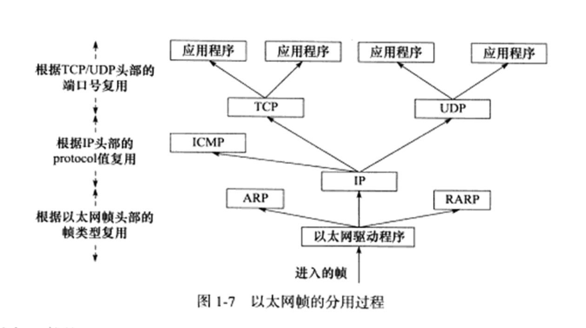

# TCP／IP协议族

## TCP／IP协议族体系结构以及主要协议

TCP／IP协议族是一个四层协议系统，自底向上分别是数据链路层、网络层、传输层和应用层，每一层完成不同的功能，而通过若干协议来实现，上层协议使用下层协议提供的服务

### 数据链路层

数据链路层实现了网卡接口的网络驱动程序，用来处理数据在物理媒介上的传输，不同的物理网络有不同的特性，网络驱动程序隐藏了这些细节，为上层协议提供一个统一的接口

数据链路层的两个常用的协议是**ARP协议(地址解析协议)**和*RARP协议(逆地址解析协议)**，他们实现了IP地址和机器物理地址(通常是MAC地址)之间的相互转换

网络层使用IP地址寻址一台机器，而数据链路层使用物理地址寻址一台机器，因为网络层必须先将目标机器的IP地址转化为物理地址，才能使用数据链路层提供的服务，这就是ARP协议的用途

### 网络层

网络层实现数据包的选路和转发，通信的两台主机一般不是直接相连的，而是通过多个中间节点(路由器)连接的，网络层的任务就是选择这些中间节点，以确定两台主机之间的通信路径。同时，网络层对上层协议隐藏了网络拓扑连接的细节，使得在传输层和网络应用层程序看来，通信的双方是直接相连的

网络层最核心的协议是**IP协议**，IP协议根据数据包的目的IP地址来决定如何投递它，是直接发送给目标主机还是寻找下一个合适的路由器来转发直到到达目标主机

另外一个重要的协议就是**ICMP协议(英特网控制报文协议)**它是IP协议的重要补充，主要用于检测网络连接，ICMP协议使用的报文格式

其中 8位类型字段用于区分报文类型，它将ICMP报文分为两大类：一是差错报文，用来回应网络错误，二是查询报文，用来查询网络信息，ping程序就是用ICMP报文查看目标是否可到达的。ICMP还用16位校验和字段对整个报文进行循环冗余校验，检验传输过程中报文是否损坏

### 传输层

传输层为两台主机上的应用程序提供端到端的通信，与网络层使用的逐跳通信方式不同，传输层只关心通信的起始端和目的端，而不在乎数据包的中转过程

传输层协议主要有三个：**TCP协议、UDP协议和SCTP协议**

**TCP协议**为应用层提供可靠的、面向连接的河基于流的服务。TCP协议使用**超时重传、数据确认等方式来确保数据被正确地发送至目的端**，因此TCP服务是可靠的，使用TCP协议通信的双方必须先建立TCP连接，并在内核中为该连接维持一些必要的数据结构，比如连接状态、读写缓冲区以及诸多定时器等，通信结束后，双方必须关闭连接释放这些内核数据，TCP服务是基于流的，基于流的数据没有边界限制，它源源不断地从通信的一端流入另一端、发送端可以逐个字节地向数据流中写入数据，接收端也可以逐个字节地将它们读出

**UDP**协议则与TCP协议完全相反，他为应用层提供不可靠、无连接和基于数据报的服务，“不可靠”意味着UDP协议无法保证数据从发送端正确地传送到目的端，数据在中途丢失，或者目的端通过检验和发现数据错误，则丢弃，则UDP协议知识简单的通知应用程序发送失败，UDP协议不会保持一个长久的联系，而且每个UDP数据报都有一个长度，接收端必须以该长度的最小单位将其所有内容一次性读出，都则数据报将被截断

**SCTP(流控制传输)**协议是一种相对较新的传输层协议

### 应用层

应用层负责处理应用程序的逻辑，数据链路层、网络层和传输层负责处理网络通信细节，要保证稳定和高效，所以它们是在内核空间中实现的。而应用层在用户空间实现，因为它负责处理众多逻辑，比如文件传输、名称查询和网络管理等。

应用层协议可能跳过传输层直接食用网络层提供的服务。

## 封装

 上层协议是如何使用下层协议提供的服务的呢？其实这是通过**封装**来实现的，应用程序数据在发送到物理网络之前，将沿着协议栈从上往下一次传递，每层协议都将在上层数据的基础上加上自己的头部信息，以实现该层的功能，这个过程称为**封装**

经过TCP封装后的数据称为**TCP报文段(segment**，TCP协议为通信双方维持一个连接，并且在内核中存储相关数据，这部分数据中的TCP头部信息和TCP内核缓冲区数据一起构成了TCP报文段

当发送端应用程序使用send/write函数向一个TCP连接写入数据时，内核中的TCP模块首先把这些数据复制到与该连接对应的TCP内核发生缓冲区中，然后TCP模块调用IP模块提供的服务，传递的参数有TCP头部信息和TCP发送缓冲区的数据，即TCP报文段

经过UDP封装后的数据称为**UDP数据报**。UDP对应用程序数据的封装与TCP类似。不同的是，UDP无须为应用层数据保存副本。如果需要重发数据报、则应用程序需要重从用户空间将该数据拷贝到UDP内核发送缓冲区

经过IP封装后的数据称为**IP数据报**，IP数据报也包括头部信息和数据部分，其中数据部分就是一个TCP报文段、UDP报文段或者是ICMP报文

经过数据链路层封装的数据称为**帧**，传输媒介不同，帧的类型也不同，有：以太网帧、令牌环帧等

帧的最大传输单元(Max Transmit Unit，MTU)，即帧最多能携带上层协议数据，通常受到网络类型的限制，所以过长的IP数据报可能需要被分片传输

帧才是最终在物理网络上传送的字节序列，至此，封装过程完成。

## 分用

当帧到达目的主机之后，将沿着协议栈自底向上一次传递，各层协议依次处理帧中本层负责的头部数据，以获取所需的信息，并最终将处理后的帧交给目标应用程序。这个过程称为**分用**

分用是依靠头部信息中的类型字段来实现的。

因为IP协议、ARP协议和RARP协议都是使用帧传输数据，所以帧的头部需要提供某个字段来区分它们，以太网帧中，使用2字节的类型字段来标识上层协议，如果是0x800,则为IP数据包，若为0x806，则为ARP模块，若为0x835，则为RARP

因为ICMP、TCP、UDP协议都使用IP协议，所以IP数据报的头部采用16位的协议字段来区分它们

TCP报文段和UDP数据报则通过其头部中的16位的端口号字段来区分上层应用程序

帧通过上述分用步骤后，最终将封装前的原始数据送至目标服务。

## ARP协议工作原理

ARP协议能实现任意网络层地址到任意网络地址的转换，其原理是：主机向自己所在的网络广播一个ARP请求，该请求包含目标机器的网络地址。此网络上的其他机器都将收到这个请求，但只有被请求的目标机器会回应一个ARP应答，其中包含自己的物理地址

### 以太网ARP请求／应答报文详解

* 硬件类型字段定义物理地址的类型，1表示MAC地址
* 协议类型字段表示要映射的协议地址类型，0x800表示IP地址
* 硬件地址长度字段和协议地址长度字段，对MAC地址来说长度为6，IPv4来说是4
* 操作字段指出4种操作类型：ARP请求、ARP应答、RARP请求、RARP回答
* 最后4个字段制定通信双方的以太网地址和IP地址，发送端填充除目的端以太网地址外的其他字段，以构建ARP请求发送，接收端填充所有的字段后，以构建ARP应答返回

## DNS工作原理

我们通常使用机器的域名来访问这台机器，而不直接使用其IP地址，那么如何将机器的域名转换为IP地址呢？这就需要使用域名查询服务，域名查询服务有多重实现方式，NIS、DNS和本地静态文件等

### DNS查询和应答报文详解

DNS是一套分布式的域名服务系统，每个DNS服务器上都存放着大量的机器名和IP地址的映射，并且是动态更新的，众多网络客户端程序都使用DNS协议来向DNS服务器查询目标主机的IP地址，DNS查询和应答的报文格式：

* 16位标识字段用于标记一对DNS查询和应答，以此区分一个DNS应答是哪个DNS查询的回应
* 16位标志用于协商具体的通信方式和反馈通信状态。DNS报文头部的16为标志字段的细节

    

    * QR 查询／应答标志，0表示查询报文，1表示应答报文
    * opcode 定义查询和应答的类型，0为标准查询 1为反向查询 2表示请求服务器组昂泰
    * AA 授权应答标志 仅由应答报文使用 1表示域名服务器是授权服务器
    * TC截断标志，仅当DNS报文使用UDP服务时使用，1表示DNS超过512字节，并被截断
    * RD 递归查询标志，1表示执行，即如果目标DNS服务器无法解析某个主机名，则它向其他DNS服务器继续查询，0表示迭代查询，如果目标DNS服务器无法解析某个主机名，则把它知道的其他DNS服务器的IP地址返回客户端
    * RA 允许递归标志
    * zero 这三位未用，为0
    * rcode 4位返回吗 表示应答的状态，0无错误 3域名不存在

## socket和TCP／IP协议族的关系

因为，数据链路层、网络层、传输层协议都是在内核中实现的，因为OS需要实现一组系统调用，使得应用程序能够访问这些协议提供的服务，实现这组系统调用的API主要两套：socket和XTI（基本不用）

由socket定义的这一API有两点功能

* 将应用程序数据从用户缓冲区中复制到TCP／UDP内核中发送缓冲区，以交付内核来发送数据，或者是从内核TCP／UDP接收缓冲区中复制数据到用户缓冲区，以读取数据

* 应用程序可以通过它们来修改内核中各层协议的某些头部信息或其他数据结构，从而今精细地控制底层通信的行为

socket也是一套通用网络编程接口，不但可以访问内核中TCP／IP协议栈，还可以访问其他网络协议栈（UNIX本地域协议栈等）