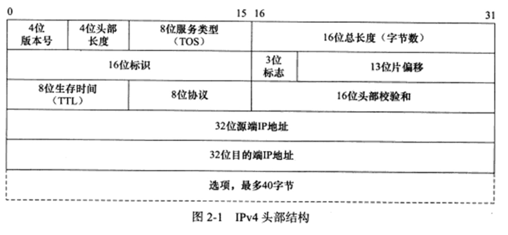
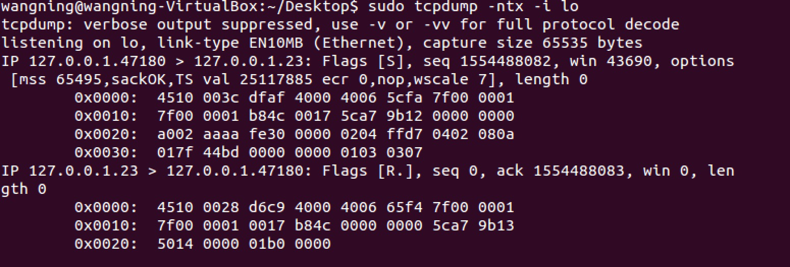
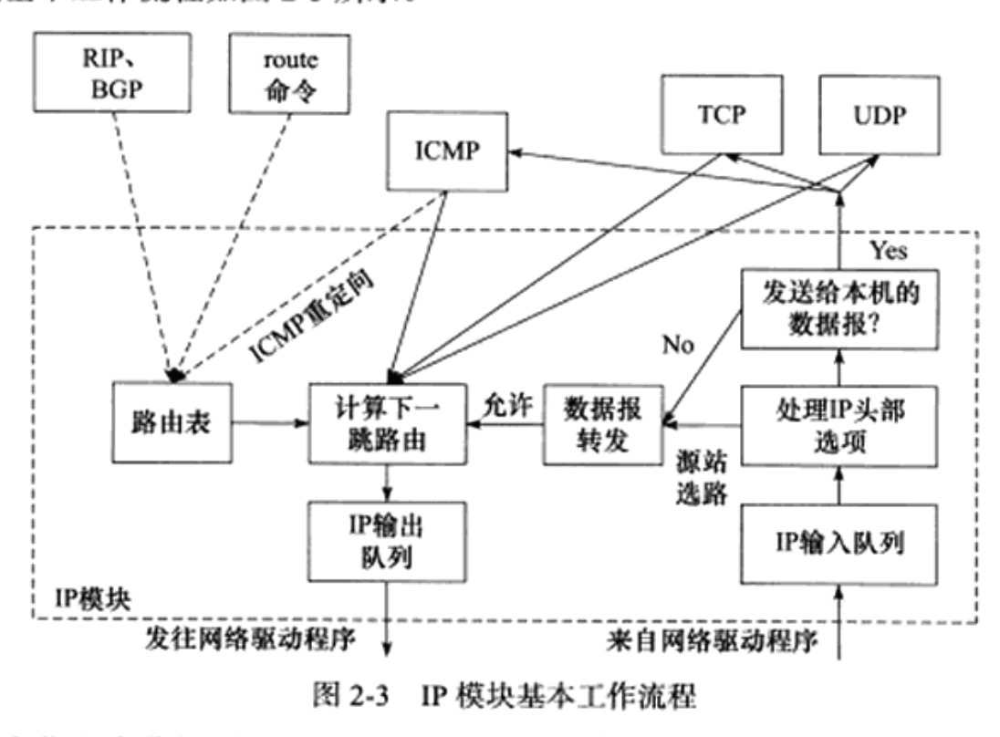
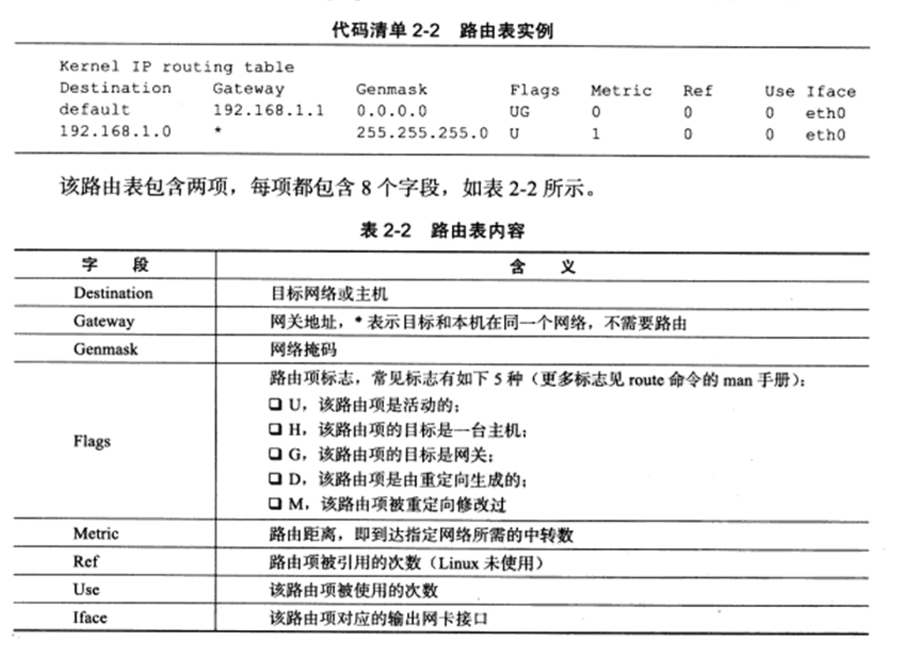
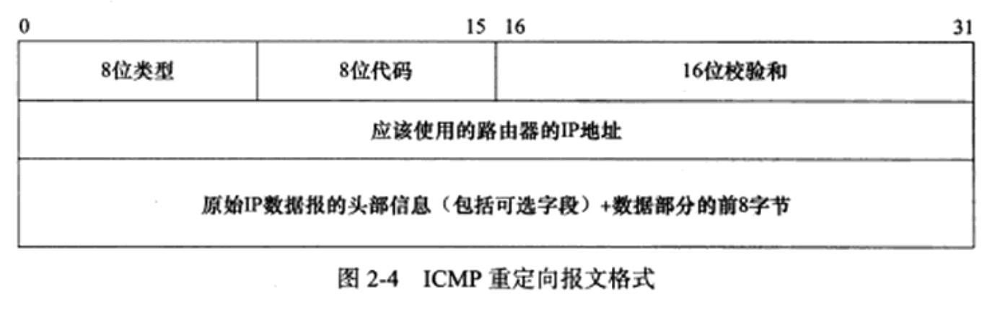

# IP 协议详解

> IP协议是TCP／IP协议族的核心协议，也是cosket网络编程的基础之一

从两个方面深入探讨IP协议

* IP头部信息。IP头部信息出现在每个IP数据报中，用于指定IP通信的源IP地址、目的端IP地址，指导IP分片和重组，以及指定部分通信行为

* IP数据报的路由和转发。IP数据报的路由和转发发生在除目标机器之外的所有主机和路由器上，它们决定数据报是否应该转发以及如何转发

## IP服务的特点

IP协议是TCP／IP协议族的动力，它为上层协议提供无状态、无连接、不可靠的服务

无状态是指IP通信双方不同步传输数据的状态信息因此所有IP数据报的发送、传输和接收都是相互独立、没有上下文的。这种服务的缺点是**无法处理乱序和重复的IP数据包**，因为接收端的IP模块只要收到了完整的IP数据报，如果是IP分片的化，IP模块将先执行重组，就将其数据部分(TCP报文段、UDP数据报或者ICMP报文)上交给上层协议，那么从上层协议来看，这些数据是乱序的、重复的，面向连接的协议，比如TCP协议，就能够自己处理乱序的、重复的报文段，它递交给上层协议的内容绝对是有序的正确的

虽然IP数据包头部提供了一个标识字段用来唯一标识一个IP数据报，但它是用来**处理IP分片和重组的，而不是用来指示接收顺序的**

IP服务的上层协议需要自己实现数据确认，超时重传等机制已达到可靠传输的目的

## IPv4头部结构

### IPv4头部结构

通常长度为20字节，除非含有可变长的选项部分



* 4位版本号指定IP协议的版本
* 4位头部长度 标识该IP头部有多少个4字节，所以IP头部最长是60字节
* 8位服务类型，包括一个3位的优先权字段，4位TOS字段和1位保留字段，4位TOS字段分别表示：最小延时、最大吞吐量、最高可靠性和最小费用。其中最多有一个能置为1，应用程序应该根据实际需要来设置它。ssh、telnet这样的应该设置最小延时服务，而ftp则需要最大吞吐量的服务
* 16位总长度是指整个IP数据报的长度，字节为单位，因为IP数据报的最大长度为65535字节，但由于MTU的限制，长度超过MTU的数据报都将被分片传输，所以实际传输的IP数据报的长度都远远没有达到最大值
* 16位标识唯一的标识主机发送的每一个数据报，其初始值由系统随机生成，每发送一个数据报，其值就加1，该值在数据报分片时就被复制到每个分片中，因此一个数据报的所有分片都具有相同的标识值
* 3位标志字段的第一位保留，第二位（Don't Fragment, DF）表示禁止分片，这种情况下，如果IP数据包长度超过MTU的话，IP模块将丢弃该数据报并返回一个ICMP差错报文，第三位(More Fragemrnt, MF), 表示“更多分片”，除了数据报的最后一个分片外，其他分破案都要把它置为1
* 13位分片偏移，是分片相对原始IP数据报开始处的偏移，实际的偏移值时该值左移3位后得到的，所以除了最后一个分片外，每个IP分片的数据部分必须是8的整数倍
* 8位生存时间(Time To Live TTL)是数据报达到目的地之前允许经过的路由器跳数，TTL值被发送端设置，常见的值为64，数据报在转发过程中每经过一个路由，该值就被路由器减1，当TTL值被减为0时，路由器丢弃数据报，并返回一个ICMP差错报文
* 8位协议用来却分上层协议，ICMP为1， TCP为6  UDP为17
* 16位头部校验和由发送端填充，接收端对其使用CRC算法校验IP数据报头部
* 32位的源IP地址和目的端IP地址来标识数据报的发送端和接收端，一般情况下，这两个地址在整个数据报传递过程中保持不变

利用`tcpdump命令进行抓包`

```
sudo tcpdump -ntx -i lo

telnet 127.0.0.1
```



此数据包共包含60字节，其中前20字节是IP头部，后40字节是TCP头部，不包含应用程序数据

## IP分片

当IP数据报的长度超过帧的MTU时，它将被分片传输，分片可能发生在发送端，也可以能发生在中转路由器上，而且可能在传输过程中被多次分片，但只有在最终的目标机器上，这些分片才会被内核中的IP模块重新组装

IP头部中的如下三个字段给IP的分片和重组提供了足够的信息：数据报标识、标志和片偏移，一个IP数据报的每个分片都具有自己IP头部，他们具有相同的标识值，但具有不同的片偏移，除了最后一个分片外，其他分片都设置MF标志，此外，每个分片的IP头部的总长度字段将被设置为该分片的长度

以太网帧的MTU是1500字节，因此它携带的IP数据报的数据部门最多是1480字节（IP头部占用20字节）

## IP路由

IP协议的一个核心人物就是数据报的路由，即决定发送数据报道目标机器的路径

### IP模块工作流程



从右到左的分析图，当IP模块接收到来自数据链路层的IP数据报时，它首先对该数据报的头部做CRC校验，确认无误之后就分析其头部的具体信息

如果该IP数据报的头部设置了源站选路选项（松散源路由选择或严格源路由选择），则IP模块调用数据报转发子模块来处理该数据报，如果该IP数据报的头部重目标IP地址是本机的某个IP地址或者是广播地址，即该数据报是发送给本纪的，则IP模块根据数据报头部中的协议字段来确定将它派发给哪个上层应用，如果不是发送给本机的，则调用数据报转发子模块来处理该数据报

数据报转发子模块首先检测系统是否允许转发，不允许则丢弃，可以则进入“计算下一跳路由”子模块，IP模块实现数据报路由的核心数据结构是路由表

虚线显示了路由表更新的过程，这一过程是指通过路由协议或者route命令调整路由表，使之更适应新的网络拓扑结构，称为IP路由策略

### 路由机制

可以使用route命令／netstat命令查看路由表



第一项的目标地址是default，即所谓的默认路由项，该项包含一个G标志，说明路由的下一跳目标是网关

IP的路由机制的三个步骤：

* 查找路由表中和数据报的目标IP地址完全匹配的主机IP地址，找到则用，没找到转步骤2
* 查找路由表中和数据报的目标IP地址具有相同网路ID的网络IP地址，找到则用，没找到则转3
* 选择默认路由项，这通常意味着数据报的下一跳路由是网关

## IP转发

前文提到，不是发送给本机的IP数据报将由数据报转发子模块来处理，路由器都能执行数据报的转发操作，而主机一般只发送和接收数据报，这是因为主机上`/proc/sys/net/ipv4/ip_forward`内核参数默认设置为0

## ICMP重定向报文

ICMP重定向报文格式如图



ICMP重定向报文的类型值是5，代码字段有4个可选值，用来区分不同的重定向类型

