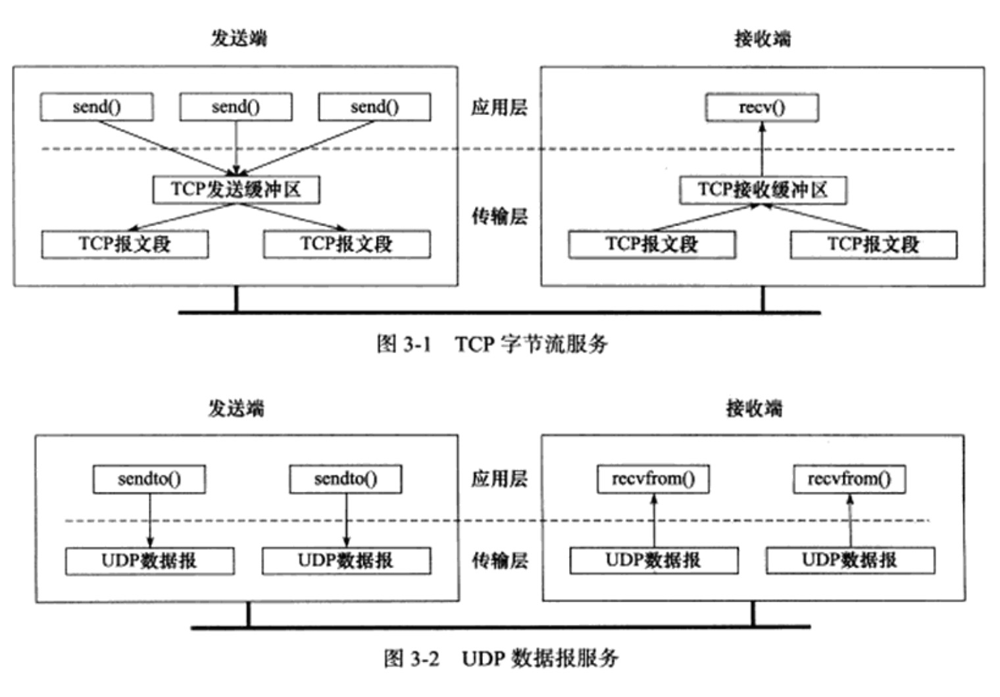
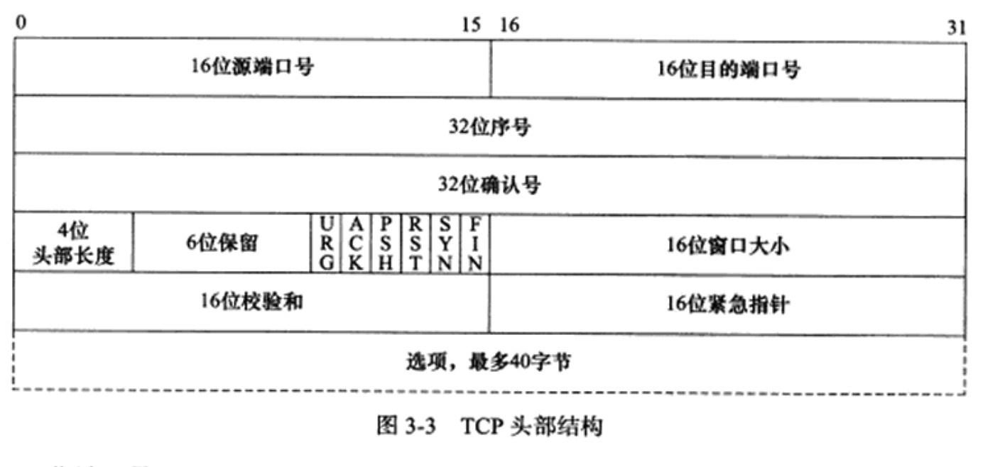
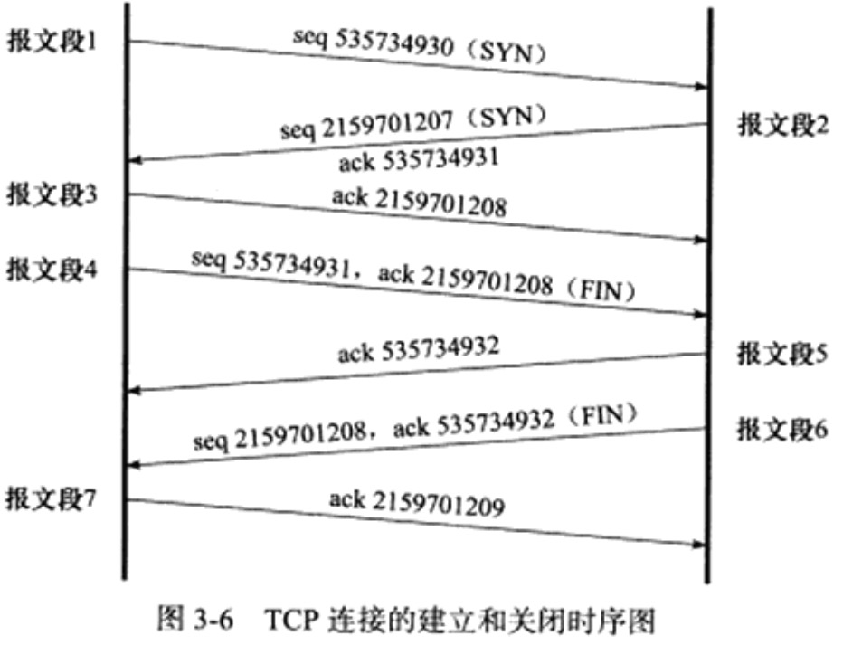
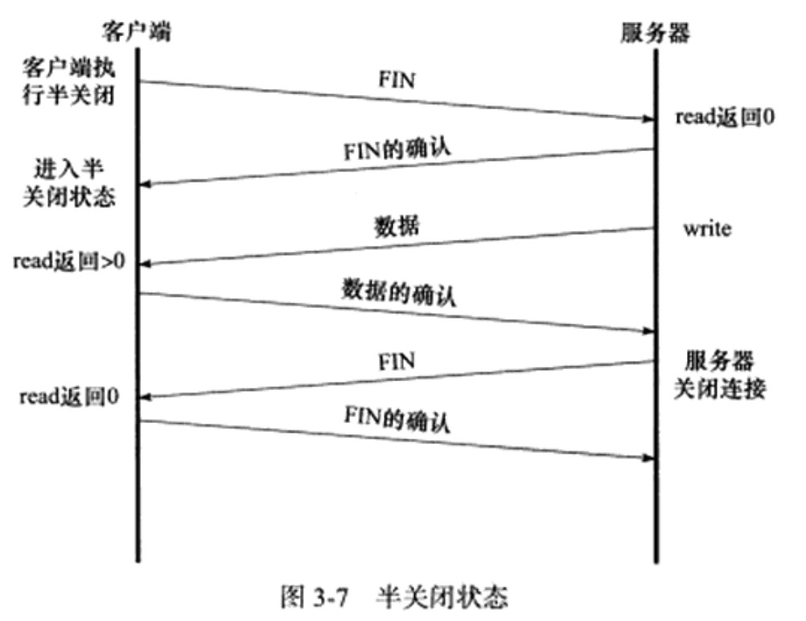
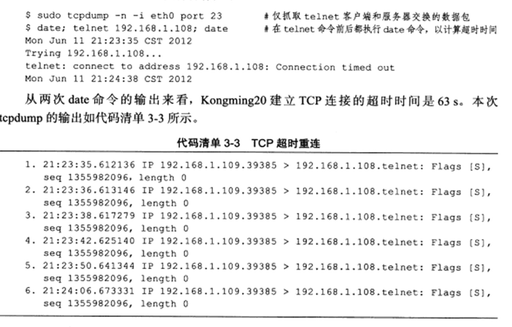
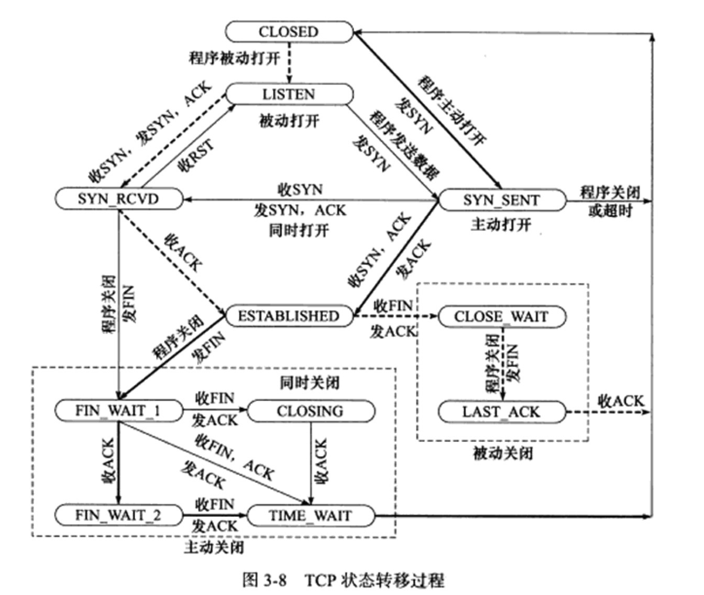
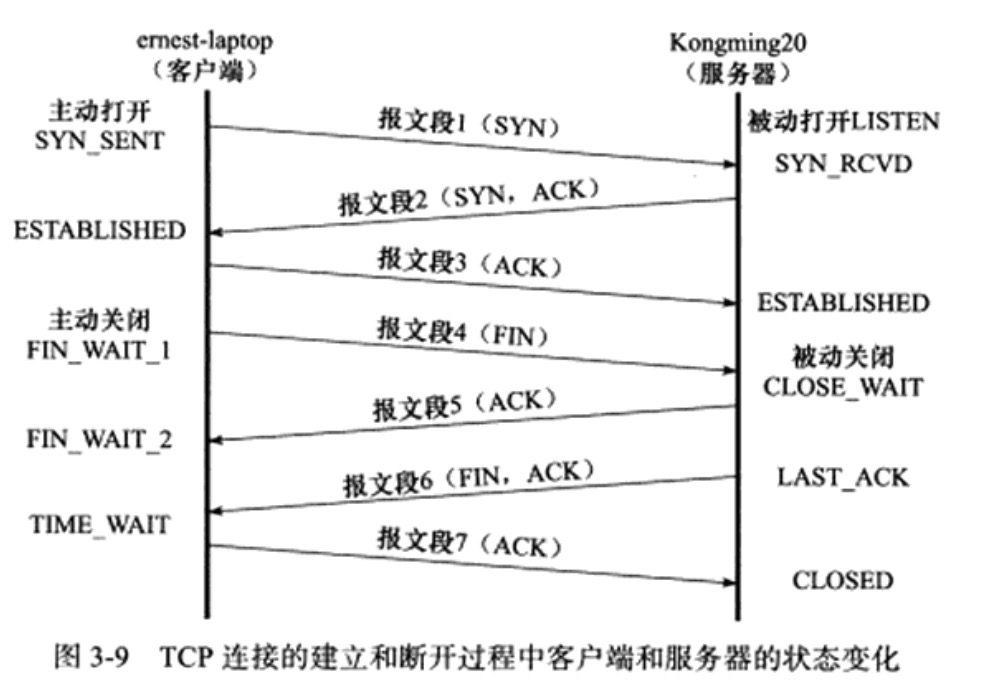

# TCP协议详解

TCP协议是TCP/IP协议族中另一个重要的协议，和IP协议相比，TCP协议更靠近应用层，因此在应用程序中具有更强的可操作性，一些重要的socket选项都和TCP协议相关

从以下四方面来讨论TCP协议：

* TCP头部信息，TCP头部信息出现在每个TCP报文段中，用于指定通信的源端端口号、目的端端口号，管理TCP连接，控制两个方向的数据流
* TCP状态转移过程，TCP连接的任意一端都是一个状态机，在TCP连接从建立到断开的整个过程中，连接两端的状态机将经历不同的状态变迁，理解TCP状态迁移对于调试网络应用程序将有很大的帮助
* TCP数据流，通过分析TCP数据流，我们快就可以从网络应用程序外部来了解应用层协议和通信双方交换的应用程序数据，两种类型的TCP数据流：交互数据流和成块数据流，还有一种特殊的数据称为紧急数据
* TCP数据流的控制，为了保证可靠传输和提高网络通信质量，内核需要对TCP数据流进行控制，主要讨论两个方面：超时重传和拥塞控制

## TCP服务的特点

传输层协议主要两个：TCP和UDP协议，TCP协议相对于UDP协议的特点是：面向连接、字节流和可靠传输

使用TCP协议通信的双方必须先建立连接，然后才能开始数据的读写。双方都必须为该连接分配必要的内核资源，以管理连接的状态和连接上数据的传输。TCP连接是全双工的，即双方的数据读写可以通过一个连接进行，完成数据交换之后，通信双方都必须断开连接以释放系统资源

TCP协议的这种连接是一对一的，所以基于广播和多播的应用程序不能使用TCP服务，而无连接协议UDP则非常适合于广播和多播

因为我们知道字节流服务和数据服务的区别，这种区别对应到实际编程中，则体现为通信双方是否必须执行相同次数的读写操作。当发送端应用程序连续执行多次写操作时，TCP模块先将这些数据放入TCP发送缓冲区中，当TCP模块真正开始发送数据时，发送缓冲区中这些等待发送的数据可能被封装成一个或多个TCP报文段发出。因此，TCP模块发送出的TCP报文段的个数和应用程序执行的写操作此书之间没有固定的数量关系

当接收端收到一个或多个TCP报文段后，TCP模块将它们携带的应用程序数据按照TCP报文段的序号依次放入TCP接收缓冲区中，并通知应用程序读取数据。接收端应用程序可以一次性将TCP接收缓冲区中的数据全部读出，也可以分多次读取，这取决于用户指定的应用程序读缓冲区的大小，因此应用程序执行的读操作次数和TCP模块接收到的TCP报文段个数之间也没有固定的数量关系

所以，发送端执行的写操作次数和接收端执行的读操作次数之间没有任何数量关系，这就是字节流的概念：应用程序对数据的发送和接收是没有边界限制得

UDP则不然，发送端应用程序每执行一次写操作，UDP模块就将其封装成一个UDP数据报并发送，接收端必须及时针对每个UDP数据报执行读操作，否则就会丢包。并且，如果用户没有指定足够的应用程序缓冲区来读取UDP数据，则UDP数据将被截断

TCP传输是可靠的，首先，TCP协议采用发送应答机制，即发送端发送的每个TCP报文段都必须得到接收方的应答，才认为这个TCP报文段传输成功

TCP协议采用超时重传机制，发送端在发送出一个TCP报文段中后启动定时器，如果定时时间内未收到应答，它将重发该报文段。因为IP数据报到达接收端可能乱序、重复，所以TCP协议还会对接收到的TCP报文段重排、整理，在交付给应用层

## TCP头部结构

TCP头部信息出现在每个TCP报文段中，用于指定通信的源端端口，目的端端口，管理TCP连接等

### TCP固定头部结构

* 16位端口号，告知主机该报文段是来自哪里以及传给哪个上层协议或应用程序的。进行TCP通信时，客户端通常使用系统自动选择的临时端口号，而服务端则使用固定的服务端口号

* 32位序号，一次TCP通信（从TCP连接建立到断开）过程中某一个传输方向上的字节流的每个字节的编号，假设主机A主机B进行TCP听信，A发送给B的第一个TCP报文段中，序号值被系统初始化为某个随机值ISN（初始序号值）那么在该传输方向上，后续的TCP报文段中序号值将被系统设置成ISN加上该报文段所携带数据的第一个字节在整个字节流中的偏移

* 32位确认号：用作对另一方发送来的TCP报文段的响应。其值是收到的TCP报文段的序号值加1。假设主机A和主机B进行TCP通信，那么A发送出的TCP报文段不仅携带自己的序号，而且包含对B发送来的TCP报文段的确认号

* 4位头部长度，标识该TCP头部有多少个32bit，TCP头部最长是60字节

* 6位标志位

    * URG标志 表示紧急指针是否有效
    * ACK标志，表示确认号是否有效， 携带ACK的TCP报文段为确认报文段
    * PSH标志 提示接收端应用程序应该立即聪TCP接收缓冲区中读走数据，为接收后续数据腾出空间
    * RST标志，表示要求对方重新建立连接  复位报文段
    * SYN标志 表示请求建立一个连接，同步报文段
    * FIN标志 表示通知对方本端要关闭连接了 结束报文段

* 16位窗口大小， 是TCP流量控制的一个手段，这里说的窗口，指的是接收通告窗口 他告诉对方本端的TCP接收缓冲区还能容纳多少字节的数据，对方可以控制发送数据的速度

* 16位校验和，进行检验是否传输过程中TCP报文段出错，头部和数据本分的检验

* 16位晋级指针，是一个正的偏移量，它和序号字段的值相加表示最后一个紧急数据的下一字节的序号

### 半关闭状态

TCP连接是全双工的，所以它允许两个方向的数据传输被独立关闭，这种连接的状态称为半关闭

socket网络编程接口通过shutdown函数提供了对半关闭的支持，使用半关闭的应用程序很少见

### 连接超时

在应用程序中，我们可以修改连接超时时间

## TCP状态转移

TCP连接的任意一端任一时刻都处于某种状态，当前状态可以通过netstat命令查看，接下来我们讨论的是TCP连接从建立到关闭的整个过程中通信两端状态的变化

CLOSED是一个假想的起始点，并不是一个实际的状态

### TCP状态转移总图

**先讨论服务器的典型状态迁移过程**

接下来说的都是指该连接的服务器端的状态

服务器通过listen系统调用进入LISTEN状态，被动等待客户端连接，因此执行的是所谓的被动打开。服务器一旦监听到某个连接请求后，就将该连接放入内核等待队列中，并向客户端发送带SYN标志的确认报文段。此时连接处于SYN_RCVD状态。如果服务器成功地接收到客户端返回的确认报文段，则该连接转移到ESTABLISHED状态。ESTABLISHED状态是连接双方能够进行双向数据传输的状态

当客户端主动关闭连接时，服务器通过返回确认报文段使连接进入CLOSE_WAIT状态，服务端检测到客户端关闭连接后，也会立即给服务端发送一个结束报文段来关闭连接，连接状态变为LAST_ACK状态，客户端返回确认报文段后，进入CLOSED状态

**下面讨论客户端的典型状态迁移过程**

接下来说的都是客户端的连接的状态

客户端通过connect系统调用主动与服务器建立连接，connect系统调用首先给服务器发送一个同步报文段，连接进入SYN_SENT状态，此后，connect可能因为两个原因失败

* 如果connect连接的目标端口不存在／该端口仍处于TIME_WAIT状态的连接所占用，则服务器将给客户端发送一个复位报文段，connect调用失败

* 如果目标端口存在，但connect在超时时间内未收到服务器的确认报文段，则connect调用失败

connect调用失败后将使立即返回到最初的CLOSED状态，客户端收到服务端的确认报文段和同步报文段，则connect调用成功返回，连接迁移至ESTABLISHED状态

当客户端执行主动关闭时，它将向服务器发送一个结束报文段，同时进入FIN_WAIT_1状态，若此时客户端收到了服务端的确认段报文，连接进入FIN_WAIT_2状态，当客户端处于FIN_WAIT_2状态时，服务器处于CLOSE_WAIT，这一对状态可能发生半关闭的状态，此时如果服务器也关闭连接，则客户端将给予确认进入TIME_WAIT状态

连续停留在FIN_WAIT_2状态下的客户端，未等到服务器关闭连接就强行退出了，此时客户端连接由内核来接管，称之为孤儿连接，linux位了防止孤儿连接长时间驻留在内核中，`/proc/sys/net/ipv4/tcp_max_orphans` 和`/proc/sys/net/ipv4/tcp_fin_timeout`来管理孤儿连接树木和生存时间

### TIME_WAIT状态

客户端连接进入TIME_WAIT状态后，在这个状态，客户端连接要等待一段长尾2MSL(报文段最大生存时间)的时间，才能完全关闭，MSL是TCP报文段在网络中的最大生存时间，建议时是2min

TIME_WAIT状态存在的原因：

* 可靠地终止TCP连接
* 保证让迟来的TCP报文段有足够的时间被识别并丢弃

第一个原因很好理解，如果再上图中，用于确认服务器结束报文段6的TCP报文段7丢失了，那么服务器将重发结束报文段，因此客户端需要停留在某个状态来处理重复抽到的结束报文段，否则，客户端将以复位报文段来回应服务器，服务器以为这是个错误，因为它期望的是一个确认报文段

在linux系统上，一个TCP端口不能同时被打开多次，当一个TCP连接处于TIME_WAIT状态时，无法立即使用该连接占有的端口来建立一个新连接。如果不存在该状态，则应用程序能够立即建立一个和刚关闭的连接相似的连接，这个新连接很可能接收到的是原来的连接的TCP报文段。

## 复位报文段

在某些特殊情况下，TCP连接的一端会向另一端发送携带RST标志的报文段，即复位报文段，通知对方关闭连接或重新建立连接

### 访问不存在的端口

当访问的端口不存在或者该端口仍然处于TIME_WAIT状态时，客户端程序将会收到复位报文段

### 异常终止连接

TCP提供了异常终止的一个连接的方法，即给对方发送一个复位报文段，一旦发送了复位报文段，发送端所有排队等待发送的数据将被丢弃

### 处理半打开连接

如果客户端或服务器往处于半打开状态的连接写入数据，则对方将会应一个复位报文段

## TCP超时重传

讨论异常网络状况下，TCP如何控制数据传输以保证其承诺的可靠服务

TCP服务必须能够重传超时时间内未收到确认的TCP报文段，为此，TCP模块为每个TCP报文段都维护一个重传定时器，该定时器在TCP报文段第一次被发送时启动，如果超时时间内未收到接收方的应答，TCP模块将重传TCP报文段并重置定时器

## 拥塞控制

### 拥塞控制概述

TCP模块还有一个重要的任务，就是提高网络利用率，降低丢包率，并保证网络资源对每条数据流的公平性，这就是所谓的拥塞控制

拥塞控制的四部分：**慢启动、拥塞避免、快速重传、快速恢复**

拥塞控制的最终受控变量是发送端向网络一次连续写入的数据量,我们称之为SWND(发送端口)。不过发送端最终以TCP报文段来发送数据，所以SWND限定了发送端能连续发送的TCP报文段数量，这些TCP报文段的最大长度称为SMSS，其值一般等于MSS

发送端需要合理的选择SWND的大小，如果SWND太小，或引起明显的网络延迟，太大则导致网络拥塞，接收方可以通过接收通告窗口(RWND)来控制发送端的SWND，其中 还引入了一个称为拥塞窗口(CWND)的状态变量，SWND是RWND和CWND中的最小者

### 慢启动和拥塞避免

慢启动的意义在于TCP模块开始发送数据时不知道网络的实际情况，需要用一种试探的方式平滑地增加CWND的大小

慢启动使得CWND指数增长

当慢启动达到了阀值时，则会进入拥塞避免阶段，拥塞避免算法使得CWND线性增长

那么如何判断拥核发生了呢？

* 传输超时
* 接收到重复的确认报文段

