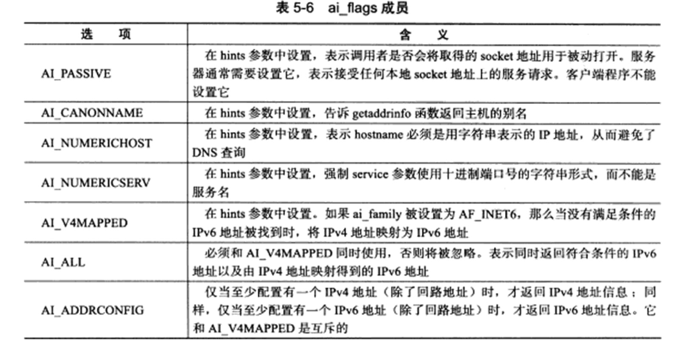
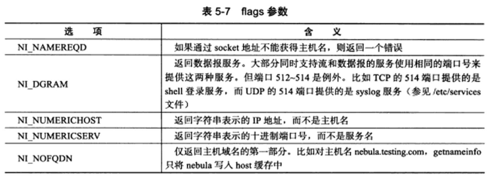

# Linux网络编程基础API

将从三个方面讨论Linux网络API
* socket地址API。socket最开始的含义是一个IP地址和端口对，它唯一地表示了使用TCP通信的一端。
* socket基础API。socket的主要API都定义在sys/socket.h头文件中，包括创建socket、明明socket、监听socket、接受连接、发起连接、读写数据、获取地址信息、检测带外标记以及读取和设置socket选项
* 网络信息API。Linux提供了一套网络信息API，以实现主机名和IP地址之间的转换，以及服务名称和端口号之间的转换，API定义在netdb.h头文件中

## socket地址API

要学习socket地址API，先要理解主机字节序和网络字节序

### 主机字节序和网络字节序

现代CPU的字节序分为大端和小端，大端的意思式高位字节存储在内存的低地址，低位字节存储在内存的高地址。小端指的是高位字节存储在内存的高地址，低位字节存储在内存的低地址

现代PC大多采用小端字节序，因为小端字节序又被称为主机字节序

当格式化的数据在两台使用不同字节序的主机之间直接传递时，接收端必然错误的解释。**解决的办法事：发送端总是把要打送的数据转化成大端字节序数据后再发送，而接收端知道对方传送过来的数据总是采用大端字节序，所以接收端可以根据自身采用的字节序决定是否对接收到的数据进行转换**

因此大段字节序也称为网络字节序，他给所有接收数据的主机提供了一个正确解释受到的格式化数据的保证

Linux提供了如下4个函数来完成主机字节序和网络字节序之间的转化

```
#include <netinet/in.h>
unsigned long int htonl(unsigned long int hostlong)
unsigned short int htons(unsigned short int hostshort)
unsigned long int ntohl(unsigned long int netlong)
unsigned short int ntohs(unsigned short int netshort)
```

`htonl` 表示 "host to network long" 即将长整型的主机字节序数据转化为网络字节序数据，这4个函数中，长整形函数通常用来转换IP地址，短整型函数用来转换端口号


### 通用socket地址

socket网络编程接口中表示socket地址的事结构体sockaddr

```
#include<bits/socket.h>
struct sockaddr
{
    sa_family_t sa_family;
    char sa_data[14];
}
```
sa_family成员事地址族类型 sa_family_t的变量，地址族类型通常与协议族类型对应。常见的协议族和对应的地址族对应关系如下

协议族 | 地址族 | 描述
--------- | ------------- | -----------
PF_UNIX | AF_UNIX | UNIX本地域协议族
PF_INET | AF_INET | TCP／IPv4协议族
PF_INET6 | AF_INET6 | TCP/IPv6协议族

宏 `PF_*` 和 `AF_*`都定义在`bits/socket.h`头文件中，且后者与前者都有完全相同的值，所以二者通常混用

sa_data成员用于存放socket地址值，但是，不同协议族的地址值具有不同的含义和长度

协议族 | 地址值含义和长度
------- | -----------
PF_UNIX | 文件的路径名，长度可达到108字节
PF_INET | 16bit端口号和32bitIPv4地址 共6字节
PF_INET6 | 16bit端口号，32bit流标识 128位IPv6地址，32位范围ID 共26字节

所以 Linux定义了下面这个新的通用socket地址结构体

```
#include <bits/socket.h>

struct sockaddr_storage 
{
    sa_family_t sa_family;
    unsigned long int __ss_align;
    char __ss_padding[128-sizeof(__ss_slign)]
}
// __ss_align成员的作用是内存对齐的
```

### 专用socket地址

Linux为各个协议族提供了专门的socket地址结构体

UNIX本地域协议族使用如下专用socket地址结构体

```
#include <sys/un.h>
struct sockaddr_un
{
    sa_family_t sin_family; // 地址族 AF_UNIX
    char sun_path[108]; // 文件路径名
}
```

TCP/IP协议族有sockaddr_in和sockaddr_in6两个专用socket地址结构体，分别用于IPv4和IPv6

```
strcut sockaddr_in
{
    sa_family_t sin_family; // AF_INET
    u_int16_t sin_port;  // 端口号，要用网络字节序表示
    struct in_addr sin_addr; // IPv4地址结构体
}
struct in_addr
{
    u_int32_t s_addr; // IPv4地址 要用网络字节序表示
}

struct sockaddr_in6
{
    sa_family_t sin6_family; // AF_INET6
    u_int16_t sin6_port; // 端口号 网络字节序表示
    u_int32_t sint_flowinfo; // 流信息 设置为0
    struct in6_addr sin6_addr; // IPv6地址结构体 
    u_int32_t sin6_scope_id; // scope ID 
}

struct in6_addr 
{
    unsigned char sa_addr[16]; //IPv6地址，网络字节序表示
}
```

### IP地址转换函数

人们习惯用可读性好的字符串来表示IP地址，比如用点分十进制字符串表示IPv4地址，以及用十六进制字符串表示IPv6地址。

但是编程中我们需要把它们转换成整数／二进制数 方能使用，而记录日志的时候，相反，把整数表示的IP地址转化为刻度的字符串

```
#include <arpa/inet.h>
in_addr_t inet_addr(const char* strptr)
int inet_aton(const char *cp, struct in_addr* inp)
char* inet_ntoa(struct in_addr in)
```

`inet_addr`函数将用点分十进制字符串表示的IPv4地址转化为用网络字节序证书表示的IPv4地址，失败时返INADDR_NONE

`inet_aton`函数完成和`inet_addr`同样的功能，但是将转化结果存储与参数inp指向的地址结构中，成功返回1，失败返回0

`inet_ntoa`函数将用网络字节序证书表示的IPv4地址转化为用点分十进制字符串表示的IPv4地址，但注意的事，该函数内部用一个静态变量存储转化结果，函数的返回值指向该静态内存，因此`inet_ntoa`是不可重入的

下面这对更新的函数也能完成和前面3个函数一样的功能

```
#include <arpa/inet.h>
int inet_pton(int af, const char* src, void* dst)
const char* inet_ntop(int af, const void* src, char* dst, socklen_t cnt)
```

`inet_pton`函数将用字符串表示的IP地址src转换成用网络字节序证书表示的OP地址，并把转换结果存储与dst指向的内存中，af表示的是地址族 `AF_INET/AF_INET6` 成功返回1，失败返回0

`inet_ntop`函数进行相反的转换，前三个参数的含义与`inet_pton`相同，最后一个参数cnt指定目标存储单元的大小

```
#include <netinet/in.h>
#define INET_ADDRSTRLEN 16
#define INET6_ADDRSTRLEN 46
```

成功返回目标存储单元的地址，失败返回NULL

## 创建socket

UNIX/Linux的一个哲学是 所有的东西都是文件，socket也不例外，他就是可读可写可控制可关闭的文件描述符

下面的socket系统调用可创建一个socket:

```
#include <sys/types.h>
#include <sys/socket.h>
int socket(int domain, int type, int protocol)
```

domain参数告诉系统使用那个底层协议族，对TCP／IP协议族而言，该参数应该设置为PF_INET／PF_INET6；对于UNIX本地域协议族而言，该参数应该设置为PF_UNIX

type参数指定服务类型，服务类型主要有SOCK_STREAM服务和SOCK_UGRAM服务， 前者表示传输层使用TCP协议，后者表示传输层使用UDP协议

protocol参数是在前两个参数构成的协议集合下，在选择一个具体的协议，不过这个值通常是唯一的，几乎在所有情况下，我们都应该把这它设为0，表示使用默认协议 

socket系统调用成功时返回一个socket文件描述符，失败则返回-1并设置errno

## 命名socket

创建socket时，我们给它制定了地址族，但是没有制定使用该地址族中的哪个具体socket地址。讲一个socket与socket地址绑定称为给socket命名，在服务器程序中，我们通常要命名socket，因为只有命名后客户端才能知道如何连接它，客户端通常则不需要命名socket，而是采用匿名的方式，OS会自动分配socket地址

命名socket的系统调用是bind

```
#include <sys/types.h>
#include <sys/socket.h>
int bind(int sockfd, const struct sockaddr* my_addr, socklen_t addrlen)
```
bind将my_addr所指的socket地址分配给未命名的sockfd文件描述符，addrlen参数指出该socket地址的长度

bind 成功时返回0，失败返回-1并设置errno，常见的errno时EACCESS和EADDRINUSE，前者表示被绑定的地址是受保护的地址，后者表示被绑定的地址正在使用中

## 监听socket

socket被命名之后，还不能马上接受客户连接，我们需要使用如下系统调用来创建一个监听队列存放待处理的客户连接

```
#include <sys/socket.h>
int listen(int sockfd, int backlog);
```
sockfd参数指定被监听的socket，backlog参数提示内核监听队列的最大长度，长度超过backlog，服务器将不受理新的客户连接，客户端将收到ECONNREFUSED错误信息。

listen成功返回0，失败返回-1，并设置errno

## 接受连接

下面的系统调用从listen监听队列中接受一个连接

```
#include <sys/types.h>
#include <sys/socket.h>
int accept(int sockfd, struct sockaddr *addr, socklen_t *addrlen);
```

sockfd参数是执行过listen系统调用的监听socket。addr参数用来获取被连接的远端socket地址，该socket地址的长度由addrlen参数指出。accept成功时返回一个新的连接socket，该socket唯一地标识了被接受的这个连接，服务器可通过读写该socket来与被接受连接对应的客户端通信。accept失败时返回-1并设置errno


## 发起连接

如果说服务端通过listen调用来被动接受连接，那么客户端需要通过如下系统调用来主动与服务器建立连接

```
#include <sys/types.h>
#include <sys/socket.h>
int connect(int sockfd, const struct sockaddr *serv_addr, socklen_t addrlen);
```

sockfd参数由socket系统调用返回一个socket，serv_addr参数是服务器监听的socket地址，addrlen参数则制定这个地址的长度

connect成功时返回-，一旦成功建立连接，sockfd就唯一标识了这个连接，客户端就可以通过读写sockfd来与服务器通信。connect失败则返回-1并设置errno，其中两种常见的errno时ECONNREFUSED和ETIMEOUT，前者表示目标端口不存在，连接被拒绝，后者表示连接超时


## 关闭连接

关闭一个连接实际上就是关闭该连接对应的socket，这可通过如下关闭普通文件描述符的系统调用来完成

```
#include <unistd.h> // unix standard
int close(int fd);
```

fd参数是待关闭的socket，不过close系统调用并非总是立即关闭一个连接，而是将fd的引用计数减1，只有当fd的饮用计数为0时，才真正关闭连接。

多进程程序中，一次fork系统调用默认将使父进程中打开的socket的引用计数加1，因此我们必须在父进程和子进程中都对该socket执行close调用才能将连接关闭

如果要立即终止连接，可以使用shutdown系统调用

```
#include <sys/socket.h>
int shutdown(int sockfd, int howto);
```
howto这个参数为SHUT_RD知关闭读，SHUT_WR只关闭写，SHUT_RDWR关闭读和写

成功返回0，失败返回-1，并设置errno

## 数据读写

### TCP数据读写

对文件的读写操作read和write同样适用于socket。但是socket编程接口提供了几个专门用于socket数据读写的系统调用，它们增加了对数据读写的控制。其中用于TCP流数据读写的系统调用是

```
#include <sys/types.h>
#include <sys/socket.h>
ssize_t recv(int sockfd, void *buf, size_t len, int flags);
ssize_t send(int sockfd, const void *buf, size_t len, int flags);
```
`recv`读取sockfd上的数据，buf和len参数分别指定读缓冲区的位置和大小，flags参数通常设置为0即可用，recv成功时返回实际读取到的数据的长度，它可能小雨我们期望的长度len。因此我们可能要多次调用recv，才能读取到完整的数据。recv可能返回0，这意味着通信对方已经关闭连接了，recv出错时返回-1并设置errno

`send`往sockfd上写入数据，buf和len参数分别指定写缓冲区的位置和大小。send成功时返回实际写入的数据的长度，失败返回-1并设置errno

flags参数为数据收发提供了额外的控制


选项名 | 含义 | send | recv
------- | ----------- | -------- | -----
MSG_CONFIRM | 只是数据链路层协议持续监听对方的回应，直到得到答复，它仅能用于SOCK_DGRAM和SOCK_RAW类型的socket | Y | N
MSG_DONTROUTE | 不查看路由表，直接将数据发送给本地局域网络内的主机。这表示发送者确切地之道目标主机就在本地网络上 | Y | N
MSG_DONTWAIT | 对socket的此次操作将是非阻塞的 | Y | Y
MSG_MORE | 告诉内核应用程序还有更多数据要发送，内核将超时等待新数据写入TCP发送缓冲区后一并发送，这样可防止TCP发送过多小的报文段，从而提高传输效率 | Y | N
MSG_WAITALL | 该操作仅在读取到指定数量的字节后才返回 | N | Y
MSG_PEEK | 窥探读缓存中的数据，此次读操作不会导致这些数据被清除 | N | Y
MSG_OOB | 发送或接收紧急数据 | Y | Y
MSG_NOSIGNAL | 往读端关闭的通道或者socket连接中写数据时不引发 SIGPIPE信号 | Y | N

### UDP数据读写

socket编程接口中用于UDP数据报读写的系统调用是

```
#include <sys/types.h>
#include <sys/socket.h>
ssize_t recvfrom(int sockfd, void*buf, size_t len, int flags, struct sockaddr* src_addr, socklen_t* addrlen);
ssize)t sendto(int sockfd, const void *buf, size_t len, int flags, const syruct sockaddr* dest_addr, socklen_t addrlen);
```
`recvfrom`读取sockfd上的数据，buf和len参数分别指定读缓冲区的位置和大小，因为UDP通信没有连接的概念，所以我们每次读取数据需要获取发送端的socket地址，即参数src_addr所指的内容，addrlen参数指定该地址的大小

`sendto`往sockfd上写入数据，buf和len参数分别指定写缓冲区的位置和大小，dest_addr参数指定接收端的socket地址，addrlen参数指定地址的长度

值得一提的是，recvfrom/sendto系统调用也可以用于面向连接(STREAM)的socket的数据读写，只要把最后两个参数都设置为NULL即可


### 通用数据读写函数

socket编程接口还提供了一对通用的数据读写系统调用，它们不仅能用于TCP流数据，也能用于UDP数据报

```
#include <sys/socket.h>
ssize_t recvmsg(int sockfd, struct msghdr* msg, int flags);
ssize_t sendmsg(int sockfd, struct msghdr* msg, int flags);
```

`struct msghdr`的定义如下

```
struct msghdr 
{
    void* msg_name;  // socket地址
    socklen_t msg_namelen // socket地址的长度
    struct iovec* msg_iov; // 分散的内存块 见后文
    int msg_iovlen; // 分散内存块的数量
    void* msg_control; // 指向辅助数据的起始位置
    socklen_t msg_controllen; // 辅助数据的大小
    int msg_flags; // 复制函数中的flags参数，并在调用过程中更新
}
```

* `msg_name`成员指向一个socket地质结构变量，它指定通信对方的socket地址，对于面向连接的TCP协议，该成员没有意义，必须被设置为NULL。

* `msg_iov`成员是iovec结构体类型的指针，iovec结构体的定义如下

    ```
    struct iovec 
    {
        void *iov_base; // 内存起始地址
        size_t iov_len; // 这块内存的长度
    }
    ```
    
    iovec结构体封装了一块内存的起始位置和长度

* `msg_iovlen`指定这样的iovec结构对象有多少个，对于recvmsg来说，数据将被读取并存放在`msg_iovlen块分散的内存中`，这些内存的位置和长度则有msg_iov只想的数组指定，这称为分散读，对于sendmsg来说，`msg_iovlen`块分散内存中的数据将被一并发送，称为集中写

* `msg_control`和`msg_controllen`成员用于辅助数据的传送

* `msg_flags`无需指定，会自动复制函数中的flags参数

## 带外标记

在实际应用中，我们通常无法预期带外数据何时到来，好在Linux内核检测到TCP紧急标志时，将通知应用程序有带外数据需要接受，内核通知应用程序带外数据到达的两种常见方式是：I/O复用产生的异常事件和SIGURG信号，但是，及时应用程序得到了有带外数据需要接收的通知，还需要知道带外数据砸数据流中的具体位置，才能准确接收带外数据，可以通过下面系统调用实现

```
#include <sys/socket.h>
int sockatmark(int sockfd);
```
sockatmark判断sockfd是否处于带外标记，即下一个被读取到的数据是否是带外数据，如果是，返回1，此时我们就可以利用带MSG_OOB标志的recv调用来接收带外数据，如果不是，返回0

## 地址信息函数

在某些情况下，我们想知道一个连接socket的本端socket地址，以及远端的socket地址

```
#include <sys/socket.h>
int getsockname(int sockfd, struct sockaddr* address, socklen_t* address_len);
int getpeername(int sockfd, struct sockaddr* address, socklen_t* address_len);
```

getsockname获取sockfd对应的socket地址，并将其存储与address参数指定的内存中，该socket地址的长度泽存储与address_len参数指向的变量中。如果实际socker地址的长度大于address所指内存去的大小，那么该socket地址将被阶段。getsockname成功时返回0，失败返回-1并设置errno

getpeername获取sockfd对应的远端socket地址，参数和getsockname一样

## socket选项

如果说fcntl系统调用时控制文件描述符属性的POSIX方法，那么下面两个系统调用则是专门用来读取和设置socket文件描述符属性的方法

```
#include <sys/socket.h>
int getsockopt(int sockfd, int level, int option_name, void* option_value, socklen_t* restrict option_len);
int setsockopt(int sockfd, int level, int option_name, const void* option_value, socklen_t option_len);
```

level | option_name | 数据类型 | 说明
------| ------------| ------- | -----
SOL_SOCKET | SO_DEBUG | int | 打开调试信息
 | SOREUSEADDR | int | 重用本地地址
 | SO_TYPE | int | 获取socket类型
 | SO_ERROR | int | 获取并清除sockrt错误状态
 | SO_DONTROUTE | int | 不查看路由表，直接将数据发送给本地局域网内的主机
 | SO_RCVBUF | int | TCP接收缓冲区大小
 | SO_SNDBUF | int | TCP发送缓冲区大小
 | SO_KEEPALIVE | int | 发送周期性保活报文以维持连接
 | SO_OOBINLINE | int | 接收到的带外数据将存留在普通数据的输入队列中，此时我们不能使用带MSG_OOB标志的读操作来读取带外数据
 | SO_LINGER | linger | 若有数据带发送则延迟关闭
 | SO_RCVLOWAT | int | TCP接受缓存区低水位标记
 | SO_SNDLOWAT | int | TCP发送缓存区低水位标记
 | SO_RCVTIMEO | timeval | 接收数据超时
 | SO_SNDTIMEO | timeval | 发送数据超时

 ### SO_REUSEADDR选项

 我们前面讨论过TCP连接的TIME_WAIT状态，并提到服务器程序可以通过socket选项SO_REUSEADDR来强制使用被出于TIME_WAIT状态的连接占用的socket地址

 ```
int sock = socket(PF_INET, SOCK_STREAM, 0);
assert(sock >= 0);
int reuse = 1;
setsockopt(sock, SOL_SOCKET, SO_REUSEADDR, &reuse, sizeof(reuse));

struct sockaddr_in address;
bzero(&address, sizeof(address));
address.sin_family = AF_INET;
inet_pton(AF_INET, ip, &address.sin_addr);
address.sin_port = htons(port);
int ret = bind(sock, (struct sockaddr*)&address, sizeof(address))
 ```

 经过setsockopt的设置之后，sock出于TIME_WAIT状态，与之绑定的sock地址也可以立即被重用

 ### `SO_RCVBUF` 和 `SO_SNDBUF`

 `SO_RCVBUF`和`SO_SNDBUF`分别表示TCP接收缓冲区和发送缓冲区的大小，不过，当我们用`setsockopt`来设置TCP的接收缓冲区和发送缓冲区的大小时，系统都会将其值加倍，并且不得小于某个最小值，接收缓冲区是256字节，发送缓冲区是2048字节，这样的目的是确保一个TCP连接拥有足够的空闲缓冲区来处理拥塞

 ### `SO_LINGER`选项

 `SO_LINGER`选项用于控制close系统调用在关闭TCP连接时的行为，默认情况下，我们使用close系统调用来关闭一个socket，close立即返回，TCP模块负责把该socker对应的TCP发送缓冲区残留的数据发送给对方

 ## 网络信息API

 socket地址的两个要素，即IP地址和端口号，都是用数值表示的。不便于记忆和扩展(从IPv4=>IPv6)

 我们接下来讨论网络信息API中比较重要的几个

 ### `gethostbyname`和`gethostbyaddr`

 `gethostbyname`函数根据主机名称获取主机的完整信息，`gethostbyaddr`函数根据IP地址获取主机的完整信息。`gethostbyname`函数通常现在本地的/etc/hosts/配置文件中查找主机，如果没有找到，再去访问DNS服务器

 ```
 #include <netdb.h>
 struct hostent* gethostbyname(const char* name);
 struct hostent* gethostbyaddr(const void* addr, size_t len, int type);
 ```
 name参数指定目标主机的主机名，addr参数指定目标主机的IP地址，len参数指定addr所指IP地址的长度，type参数指定addr所指IP地址的类型，其合法值包括 AF_INET、AF_INET6

 两个函数返回的都是hostent结构体类型的指针，hostent结构体的定义如下

 ```
 #include <netdb.h>
 struct hostent
 {
     char* h_name; // 主机名
     char** h_aliased; // 主机名列表，可能有多个
     int h_addrtype; // 地址类型 地址族
     int H_length; // 地址长度
     char** h_addr_list ; // 按网络字节序列出的主机IP地址列表
 }
 ```

 ### getservbyname 和 getservbyport

 getservbyname函数根据名称获取某个服务的完整信息，getservbyport函数根据端口号获取某个服务的完整信息，实际上都是通过/etc/services文件来获取服务的信息的。

 ```
 #include <netdb.h>
 struct servent* getservbyname(const char* name, const char* proto);
 struct servent* getservbyport(int port, const char* proto);
 ```

 name参数指定目标服务的名字，port参数指定目标服务对应的端口号。proto参数指定服务类型，给它传递tcp表示获取流服务，传递udp表示获取数据报服务，传递NULL表示获取所有类型的服务

 返回的事servent结构体类型的指针，结构体servent定义如下

 ```
 #include <netdb.h>
 struct servent
 {
     char* s_name; // 服务名称
     char** s_aliases; // 服务的别名列表，可能有多个
     int s_port; // 端口号
     char* s_proto; // 端口类型，通常是tcp或者udp
 }
 ```


 ### getaddrinfo

 getaddrinfo函数既能通过主机名获得IP地址，内部使用的事gethostbyname函数，也能通过服务名获得端口号，内部使用getservbyname函数，

 ```
 #include <netdb.h>
 int getaddrinfo(const char* hostname, const char* service, const struct addrinfo* hints, struct addrinfo** result);
 ```

 hostname参数可以接收主机名，也可以接收字符串表示的IP地址，同样，service参数可以接收服务名，也可以接收字符串表示的十进制端口号，hints参数可以被设置为NULL，表示允许getaddrinfo的输出进行更紧缺的控制。hints参数可以被设置为NULL，表示允许getaddrinfo反馈任何可用的结果。result参数指向一个链表，该链表用于存储getaddrinfo反馈的结果

 ```
 struct addrinfo 
 {
     int ai_flags; // 下表
     int ai_family; //地址族
     int ai_socktype; // 服务类型，SOCK_STREAM / SOCK_DGRAM
     int ai_protocol; // 下表
     socklen_t  ai_addrlenl // socket地址ai_addr的长度
     char* ai_canonname; // 主机的别名
     struct sockaddr* ai_addr; // 指向socket地址
     struct addrinfo* ai_next; // 指向下一个sockinfo结构的对象
 }
 ```

 该结构体中，ai_protocol成员是指具体的网络协议，其含义和socket调用的第三个参数相同，它通常被设置为0，ai_flags成员如下

 

 ### getnameinfo

 getnameinfo函数能通过socket地址同时获得以字符串表示的主机名和服务名

 ```
 #include <netdb.h>
 int getnameinfo(const struct sockaddr* sockaddr, socklen_t addrlen, char* host, socklen_t hostlen, char* serv, socklen_t servlen, int flags);
 ```

 getnameinfo将返回的主机名存储在host参数指向的缓存中，讲服务名存储在serv参数中，hostlen和servlen参数分别指定这两块缓存的长度，flags参数控制geynameinfo的行为

 