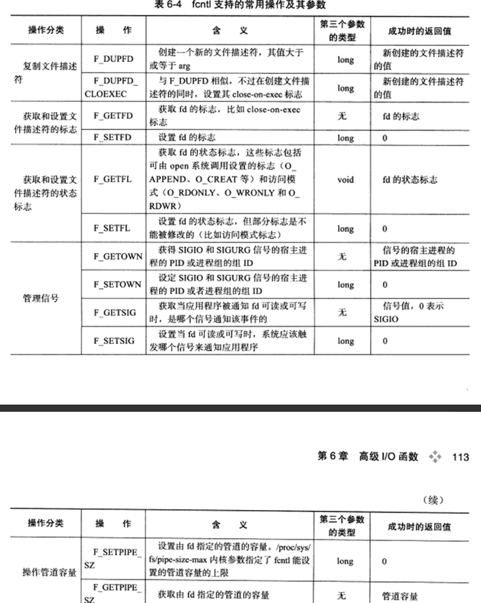

# 高级I／O函数

讨论网络编程相关的几个，这些函数大致分为三类：
* 用于创建文件描述符的函数，包括pipe、dup/dup2函数
* 用于读写数据的函数，包括readv/writev、sendfile、mmap/munmap、splice和tee函数
* 用于控制I/O行为和属性的函数，包括fcntl函数

## pipe函数

pipe函数可用于创建一个管道，已实现进程间通信。pipe函数的定义如下：

```
#include <unistd.h>
int pipe(int fd[2]);
```
pipe函数的参数是一个包含两个int型整数的数组指针。该函数成功时返回0，并将一对打开的文件描述符值填入其参数指向的数组，如果失败，则返回-1并设置errno

通过pipe函数创建的这两个文件描述符fd[0]和fd[1]分别构成管道的两端，往fd[1]写入的数据可以从fd[0]读出，并且，fd[0]只能用于从管道读出数据，fd[1]则只能用于往管道写入数据，而不能反过来使用。如果要实现双向的数据传输，就应该使用两个管道。

默认情况下，这一块文件描述符都是阻塞的，此时如果我们用read系统调用来读取一个空的管道，则read被阻塞，直到管道内有数据可读；如果我们用write系统调用来往一个满的管道中写入数据，则write也被阻塞，直到管道又足够多的空闲空间可用。

但如果应用程序将fd[0]和fd[1]都设置为非阻塞的，则read和write有不同的行为。

如果管道的写端文件描述符fd[1]的引用计数减少为0，即没有任何进程需要往管道中写入数据，则针对该管道的读端文件描述符fd[0]的read操作将返回0，即读取到了文件结束标记(EOF)

如果管道的读端文件描述符fd[0]的引用计数减少至0，即没有任何进程需要从管道读取数据，则针对该管道的写端文件描述符fd[1]的write操作将失败，并引发SIGPIPE信号。

管道内部传输的数据是字节流，这和TCP字节流的概念相同。但两者又有细微的区别。

应用程序能往一个TCP连接中写入多少字节的数据，取决于对方的接收通告窗口的大小和本端的拥塞窗口的大小。而管道本身拥有一个容量限制，规定该管道最多能被写入多少字节的数据，现在管道容量的大小默认是65536字节，可以使用fcntl函数来修改管道容量

socketpair函数，能够方便地创建双向管道
```
#include <sys/types.h>
#include <sys/socket.h>
int socketpair(int domain, int type, int protocol, int fd[2]);
```

前三个参数的含义和socket系统调用的三个参数相同，但是domain只能使用AF_UNIX，最后一个参数和pipe系统调用的参数一样，只不过socketpair创建的这对文件描述符是可读可写的

## dup函数和dup2函数

有时候我们希望把标准输入重定向到一个文件，或者把标准输出重定向到一个网络连接，这可以通过下面的用于复制文件描述符的dup和dup2函数来实现

```
#include <unistd.h>
int dup(int file_descriptor);
int dup2(int file_descriptor_one, int file_descriptor_two);
```

dup函数创建一个新的文件描述符，该新文件描述符和原有文件描述符file_scriptor指向相同的文件、管道或者网络连接。并且dup返回的文件描述符总是取系统当前可用的最小整数值。dup2和dup类似，不过它将返回一个不小于`file_descriptor_two`的整数值。dup和dup2系统调用失败时返回-1并设置errno

## readv函数和writev函数

readv函数将数据从文件描述符读到分散的内存块，即分散读；
writev函数则将多块分散的内存数据一并写入文件描述符中，即集中写。

```
#include <sys/uio.h>
ssize_t readv(int fd, const struct iovec* vector, int count);
ssize_t writev(int fd, const struct iovec* vector, int count);
```

```
struct iovec {
    void* iov_base; // pointer to data
    size_t iov_len; // length of data
}
```
fd参数是被操作的目标文件描述符，vector参数的类型是iovec结构数组，该结构体描述的是一块内存区。count参数是vector数组的长度，即有多少块内存数据需要从fd读出或写到fd。readv和writev在成功时返回读出／写入fd的字节数，失败返回-1并设置errno

## sendfile函数

sendfile函数在两个文件描述符之间直接传递数据，从而避免了内核缓冲区和用户缓冲区指尖的数据拷贝，效率很高，这就称为零拷贝

```
#include <sys/sendfile.h>
ssize_t sendfile(int put_fd, int in_fd, off_t* offert, size_t count);
```

in_fd参数是待读出内容的文件描述符，`out_fd`参数是待写入内容的文件描述符。offset参数指定从读入文件流的哪个位置开始读，如果为空，则使用文件流默认的起始位置。

count参数指定在文件描述符in_fd和out_fd之间传输的字节数。sendfile成功时返回传输的字节数，失败则返回-1并设置errno

in_fd必须是一个支持类似mmap函数的文件描述符，即它必须指向真实的文件，不能是socker和管道，而out_fd则必须是一个socket

## mmap函数和munmap函数

mmap函数用于申请一段内存空间，我们可以将这段内存作为通信的共享内存，也可以将文件直接映射到其中。munmap函数则释放由mmap创建的这段内存空间

```
#include <sys/mman.h>
void *mmap(void *start, size_t length, int port, int flags, int fd, off_t offset);
int munmap(void *start, size_t length);
```

start参数允许用户使用某个特定的地址作为这段内存的起始地址。如果被设置为NULL，则系统自动分配一个地址。length参数指定内存段的长度，port参数用来设置内存段的访问权限

* PORT_READ 可读
* PORT_WRITE 可写
* PORT_EXEC 可执行
* PORT_NONE 不能被访问

flags参数控制内存段内容被修改后程序的行为

* MAP_SHARED 在进程间共享内存，对该内存段的修改将反映到被映射的文件中
* MAP_PRIVATE 内存段为调用进程私有
* MAP_ANONYMOUS  这段内存不是从文件映射而来的
* MAP_FIXED 必须位于start参数指定的地址处，start必须是内存页面大小(4096)的整数倍
* MAP_HUGETLB 按照 大内存页面来分配内存空间

fd是文件对应的文件描述符

mmap函数成功时返回指向目标内存区域的指针，失败返回MAP_FAILED((void*)-1)设置errno

## splice函数

splice函数用于在两个文件描述符之间移动数据，也是零拷贝操作

```
#include <fcntl.h>
ssize_t splice(int fd_in, loff_t* off_in, int fd_out, loff_t* off_out, size_t len, unsigned int flags);
```

* `fd_in`参数是待输入数据的文件描述符。如果`fd_in`是一个管道文件描述符，那么`off_in`参数必须被设置为NULL，如果`fd_in`不是一个管道文件描述符，那么`off_in`表示从输入数据流的何处开始读取数据
* len 参数指定移动数据的长度
* flags参数则控制数据如何移动

    * `SPLICE_F_MOVE` 如果合适的话，按整页内存移动数据
    * `SPLICE_F_NONBLOCK` 非阻塞的splice操作，但实际效果还会受文件描述符本身的阻塞状态的影响
    * `SPLICE_F_MORE` 后续的splice调用将读取更多数据
    * `SPLICE_F_GIFT` 对splice没有效果


## tee函数

tee函数在两个管道文件描述符之间复制数据，也是零拷贝操作，不消耗数据，所以源文件描述符上的数据仍然可以用于后续的读操作

```
#inlcude <fcntl.h>
ssize_t tee(int fd_in, int fd_out, size_t len, unsigned int flags);
```

tee函数成功时返回在两个文件描述符之间复制的数据数量。返回0表示没有复制任何数据，tee失败时返回-1并设置errno

## fcntl函数

fcntl函数，正如其名字描述的那样，提供了对文件描述符德各种控制操作。

另外一个常见的控制文件描述符属性和行为的系统调用时ioctl，而ioctl比fcntl能够执行更多的控制。

```
#include <fcntl.h>
int fcntl(int fd, int cmd, ...);
```

fd参数是被操作的文件描述符，cmd参数指定执行何种类型的操作

