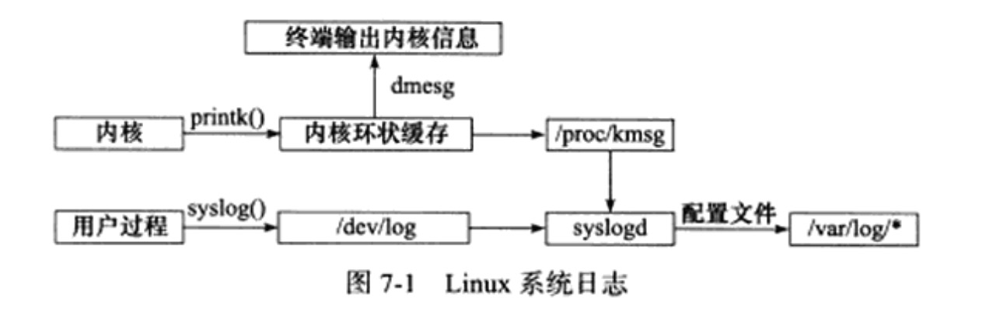

# Linux服务器程序规范

服务器程序规范：

* Linux服务器程序一般以后台进程形式运行。后台进程又称为守护进程(daemon)，没有控制终端，因而也不会意外接收到用户输入。守护进程的父进程通常是init进程

* Linux服务器程序通常有一套日志系统，它至少能输出日志到文件

* Linux服务器程序一般以某个专门的非root身份运行

* Linux服务器程序通常是可配置的

* Linux服务器进程通常在启动的时候生成一个PID文件并存入/var/run目录中，以记录该后台进程的PID

* Linux服务器程序通常需要考虑系统资源和限制，以预测自身承受的最大负荷

## 日志

### Linux系统日志

Linux提供一个守护进程来处理系统日志-syslogd，现在有它的升级版rsyslogd

rsyslogd守护进程既能接收用户进程输出的日志，又能接收内核日志。用户进程是通过调用syslog函数生成系统日志的。该函数将日志输出到一个UNIX域socket类型的文件/dev/log中，rsyslogd则监听该文件以获取用户进程的输出。

内核日志在老的系统上是通过另外一个守护进程rklogd来管理的，rsyslogd利用额外的模块实现了相同的功能。

内核日志由printk等函数打印至内核的环状缓存中。环状缓存的内容直接映射到/proc/kmsg文件中，rsylogd则通过读取该文件获得内核日志



### syslog函数

应用程序使用syslog函数与rsyslogd守护进程通信，syslog函数的定义如下

```
#include <syslog.h>
void syslog(int priority, const char* message, ...);
```

该函数采用可变参数（第二个参数message和第三个参数）来结构化输出。

priority参数是所谓的设施值与日志级别的按位或。设施值的默认值是LOG_USER

```
#include <syslog.h>
#define LOG_EMERG   0 // 系统不可用 
#define LOG_ALERT   1 // 报警 需要立即采取动作 
#define LOG_CRIT   2 // 非常严重的情况
#define LOG_ERR   3 // 错误
#define LOG_WARNNING   4 // 警告
#define LOG_NOTICE    5 // 通知
#define LOG_INFO   6 // 信息
#define LOG_DEBUG   7 // 调试
```

```
#include <syslog.h>
void openlog(const char* ident, int logopt, int facility);
```
## 用户信息

### UID、EUID、GID和EGID

用户信息对于服务器程序的安全性来说是很重要的，大部分服务器就必须以root身份启动，但不能以root身份运行。

下面这一组函数可以获取和设置当前进程的真实用户ID(UID)，有效用户ID(EUID)，真实组ID(GID)，有效组ID(EGID)

```
#include <sys/types.h>
#include <unistd.h>
uid_t getuid();
uid_t geteuid();
gid_t getgid();
gid_t getegid();
int setuid(uid_t uid);
int seteuid(uid_t uid);
int setgid(gid_t gid);
int setegid(uidgid_t_t gid);
```

需要指出的是：一个进程拥有两个用户ID：UID和EUID。EUID存在的目的是方便资源访问，它使得运行程序的用户拥有该程序的有效用户的权限。

EUID是文件所有者的ID

## 进程间关系

### 进程组

Linux下每个进程都隶属于一个进程组，因此它们除了PID信息外，还有进程组ID(PGID) 我们可以用如下函数来获取指定进程的PGID

```
#include <unistd.h>
pid_t getpgid(pid_t pid);
```
该函数成功时返回进程pid所属进程组的PGID，失败则返回-1并设置errno

每个进程组都有一个首领进程，其PGID和PID相同，进程组将一直存在，直到其中所有进程都退出，或者加入到其他进程组

```
#include <unistd.h>
int setpgid(pid_t pid, pid_t pgid);
```
该函数将PID为pid的进程的PGID设置为pgid，如果pid和pgid相同，则由pid指定的进程将被设置为进程组首领，如果pid为0，则表示设置当前进程的PGID为pgid，如果pgid为0，则使用pid作为目标PGID。成功返回0，失败则返回-1并设置errno

### 会话

一些有关联的进程组将形成一个会话（session）

一个会话又可以包含多个进程组。一个会话对应一个控制终端


```
#include <unistd.h>
pid_t setsid(void);

pid_t getsid(pid_t pid);
```

## ps查看进程关系

```
ps -o pid,ppid,pgid,sid,comm
```

## 改变工作目录和根目录

获取进程当前工作目录和改变进程工作目录的函数

```
#include <unistd.h>
char *getcwd(char* buf, size_t size);
int chdir(const char* path);
```

## 服务器程序后台化

```
void daemon_mode(void) 
{
  int fr=0;

  fr = fork();
  if( fr < 0 )
  {
    fprintf(stderr, "fork() failed\n");
    exit(1);
  }
  
  if ( fr > 0 ) 
  {
    exit(0);
  }

  if( setsid() < 0 ) 
  {
    fprintf(stderr, "setsid() failed\n");
    exit(1);
  }

  fr = fork();
  if( fr < 0 ) 
  {
    fprintf(stderr, "fork() failed\n");
    exit(1);
  }
  
  if ( fr > 0 ) 
  {
    fprintf(stderr, "forked to background (%d)\n", fr);
    exit(0);
  }

  umask(0);

  chdir("/");
  close(0);
  close(1);
  close(2);

  open("/dev/null", O_RDWR);
  dup(0);
  dup(0);
}
```