# 高性能服务器程序框架

服务器解构为如下三个主要模块

* I/O处理单元， I/O处理单元的四种I/O模型和两种高效事件处理模式
* 逻辑单元。介绍逻辑单元的两种高效并发模式
* 存储单元。服务器程序的可选模块

## 服务器模型

### C/S模型

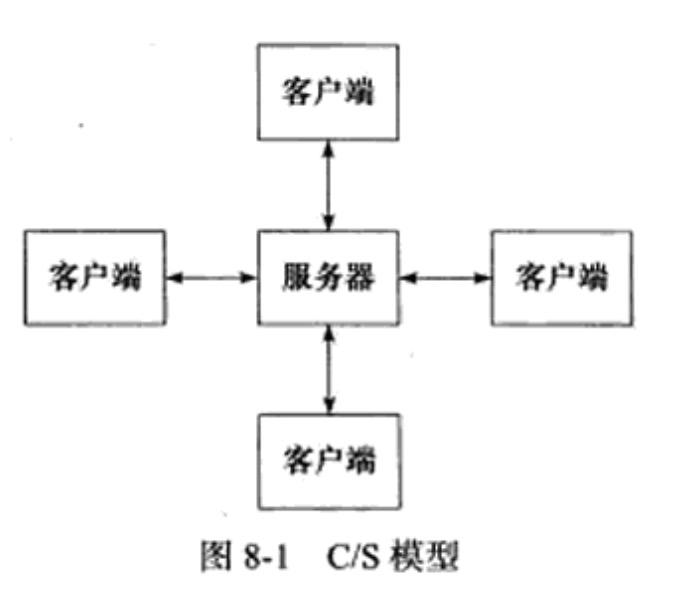 

C/S模型的逻辑很简单，服务器启动后，首先创建一个(或多个)监听socket，并调用bind函数将其绑定到服务器感兴趣的端口上，然后调用listen函数等待客户连接。

服务器稳定运行之后，客户端可以跳用connect函数想服务器发起连接了。由于客户连接请求是随机到达的异步事件，服务器需要使用某种I/O模型来监听这个事件。

下图是使用I/O复用技术之一的select系统调用。让监听到连接请求后，服务器就调用accept函数接受它，并分配一个逻辑单元为新的连接服务，逻辑单元可以是新创建的子进程、子线程或者其他。下图中，服务器给客户端分配的逻辑单元是由fork创建的子进程。逻辑单元读取客户请求，处理该请求然后将处理结果返回给客户端。客户端接收到服务器反馈的结果之后，可以继续向服务器发送请求，也可以关闭。客户端主动关闭连接，则服务器执行被动关闭连接，通信结束

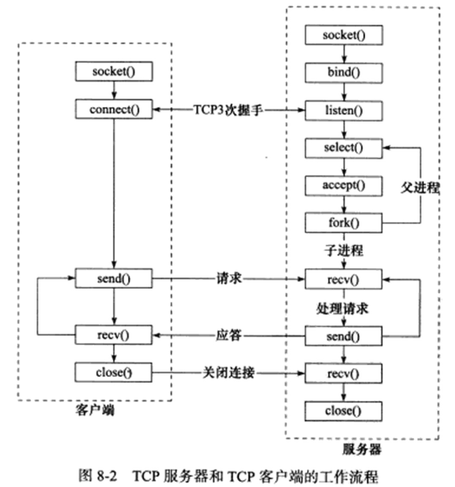

### P2P模型

P2P模型就是每台主机既是客户端又是服务器

## 服务器编程框架

基本框架的组成

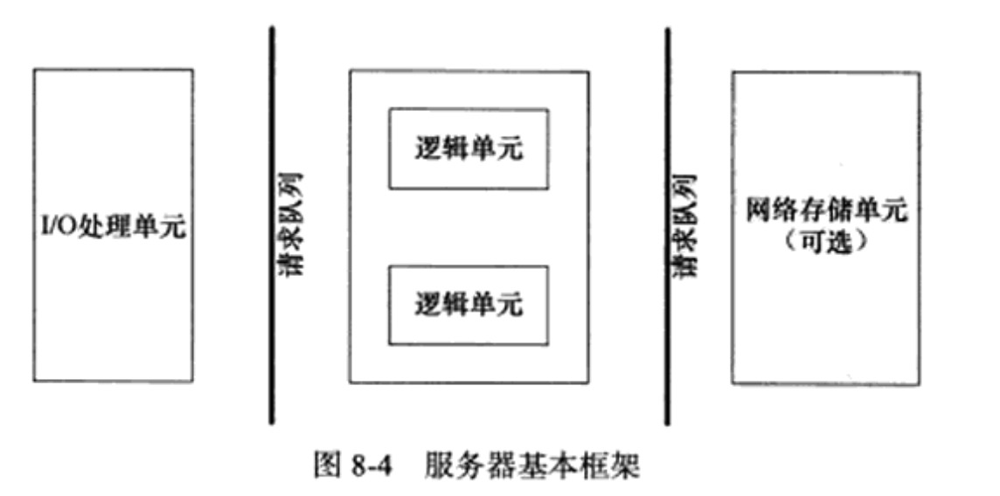

该图既能用来描述一台服务器，也能用来描述一个服务器集群

模块 | 单个服务器程序 | 服务器机群
--------- | ------------- | ----------------
I/O处理单元 | 处理客户连接，读写网络数据 | 作为接入服务器，实现负载均衡
逻辑单元 | 业务进程或线程  | 逻辑服务器
网络存储单元 | 本地数据库、文件或缓存 | 数据库服务器
请求队列 | 各单元之间的通信方式 | 各服务器之间的永久连接

I/O处理单元是服务器管理客户连接的模块。通常刚工作：等待并接入新的客户连接，接收数据，将服务器响应数据返回给客户端，对于服务器机群来说，I／O处理单元是一个专门的接入服务器，它实现负载均衡，从所有逻辑服务器中选取负荷最小的一代来为新客户服务

一个逻辑单元通信是一个进程／线程，处理并分析客户数据，结果发给I/O处理单元或者直接发给客户端，服务器机群则是一台逻辑服务器，服务器通常拥有多个逻辑单元，实现对多个客户任务的并行处理

网络存储单元可以是数据库、缓存和文件，甚至是一台独立的服务器

请求队列是各单元之间的通信方式的抽象，I/O处理单元接收到客户请求时，需要以某种方式通知一个逻辑单元来处理该请求。同样，逻辑单元访问一个存储单元的时候，冶陶通信协调处理竞态条件。请求队列通常被实现为池的一部分。对于服务器集群来说，请求队列是各台服务器之间预先建立的、静态的、永久的TCP连接

## I/O模型

socket在创建的时候默认是阻塞的，我们可以给socket系统调用的第2个参数传递SOCK_NONBLOCK标志，将其设置为非阻塞的。阻塞和非阻塞的概念能应用于文件描述符，而不仅仅是socket。我们称阻塞的文件描述符为阻塞I/O,称非阻塞的文件描述符为非阻塞I/O.

针对阻塞I/O执行的系统调用可能因为无法立即完成而被操作系统挂起，直到等待的事件发生为止。

比如，客户端connect服务端发起连接时，connect将首先发送同步报文段，则connect会被挂起，直到客户端受到确认报文段并唤醒connect调用后，socket的基本API中，可能阻塞的有accept、send、recv和connect

针对非阻塞I/O执行的系统调用则总是立即返回，而不管事件是否已经发生，如果事件没有立即发生，系统调用则返回-1，和出错的情况一样，我们此时必须根据errno来区分两种情况，对accept、send和recv而言，事件未发生时errno通常被设置成EAGAIN、EWOULDBLOCK，对connect而言则是EINPROGRESS

只有在事件已经发生的情况下操作非阻塞I/O，才能提高程序的效率，因此，非阻塞I/O通常要和其他I/O机制一起使用，I/O复用和SIGIO信号

I/O复用是最常使用的I/O通知机制，应用程序通过I/O复用函数向内核注册一组事件，内核通过I/O复用函数把其中就绪的事件通知给应用程序。Linux上常用的I/O复用函数是select、poll和epoll。需要指出的事，I/O复用函数本身就是阻塞的，他们能够提高程序效率的原因在于它们具有同时监听多个I/O事件的能力

SIGIO信号也可以用来报告I/O事件，我们可以为一个目标文件描述符制定宿主进程，那么被指定的宿主进程将捕捉到SIGIO信号，当目标文件描述符上有事件发生，SIGIO信号的信号处理函数被触发，就可以在该信号处理函数中对目标文件描述符执行非阻塞I/O操作了

阻塞I/O、I/O复用和信号驱动I/O都是同步I/O模型，因为I/O的读写操作，都是在I/O事件发生之后，由应用程序来完成的。

而POSIX规范所定义的异步I/O模型不同，对异步I/O而言，用户可以直接对I/O执行读写操作，这些操作告诉内核用户读写缓冲区的位置，以及I／O操作完成之后内核通知应用程序的方式。

异步I/O的读写操作总是立即返回，而不论I/O是否阻塞的，因为真正的读写操作由内核接管了，同步I/O模型要求用户自行执行I/O操作，而异步I/O机制则由内核来执行操作

## 两种高效的事件处理模式

两种高效的事件处理模式： Reactor和Proactor

同步I／O模型通常用于实现Reactor模式，异步I/O模型用于实现Proactor模式
不过同步I/O也可以模拟出Proactor模式

### Reactor模式

Reactor模式：它要求主线程（I/O处理单元）只负责监听文件描述符上是否有事件发生，有的话立即将该事件通知工作线程(逻辑单元)，除此之外，主线程不做任何其他实质性的工作。读写数据，接受新的连接，以及处理客户请求均在工作线程

使用同步I/O模型(以epoll为例)实现的Reactor模式的工作流程是

* 主线程往epoll内核时间表中注册socket上的读就绪事件
* 主线程调用epoll_wait等待socket上有数据可读
* 当socket上有数据可读时，epoll_wait通知主线程，主线程则将socket可读事件放入请求队列
* 睡眠在请求队列上的某个工作线程被唤醒，它从socket读取数据，并处理客户请求，然后往epoll内核事件表注册该socket上的写就绪事件
* 主线程调用epoll_wait等待socket可写
* 当socket可写时，epoll_waite通知主线程，主线程将socket可写事件放入请求队列
* 睡眠在请求队列上的某个工作线程被唤醒，它往socket上写入服务器处理客户请求的结果

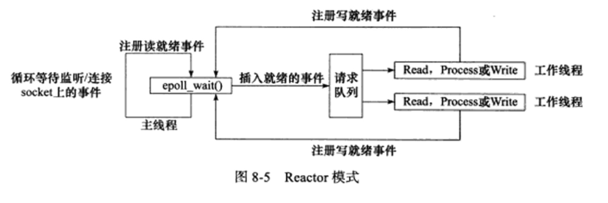

工作线程从请求队列中取出事件后，将根据事件的类型来决定如何处理它，对于可读事件，执行数据和处理请求的操作，对于可写事件，执行写数据的操作，在Reactor模式中，没有必要区分所谓的读写工作线程

### Proactor模式

与Reactor模式不同的是，Proactor模式将所有I／O操作都将给主线程和内核来处理，工作线程仅仅负责业务逻辑

使用异步I/O模型(以aio_read/aio_write为例)实现的Proactor模式的工作流程：

* 主线程调用aio_reac函数向内核注册socket上的读完成事件，并告诉内核用户读缓冲区的位置，以及读操作完成时如何通知应用程序

* 主线程继续处理其他逻辑

* 当socket上的数据被读入用户缓冲区后，内核将向应用程序发送一个信号，通知应用程序数据可以使用

* 应用程序预先定义好的信号处理函数选择一个工作线程来处理客户请求，工作线程处理完客户请求之后，调用aio_write函数向内核注册socket上的写完成事件，并告诉内核用户写缓冲区的位置，以及写操作完成时如何通知应用程序

* 主线程继续处理其他逻辑

* 当用户缓冲区的数据倍写入socket之后，内核将向应用程序发送一个信号，一统志应用程序数据发送完毕

* 应用程序预先定义好的信号处理函数选择一个工作线程来做善后处理。

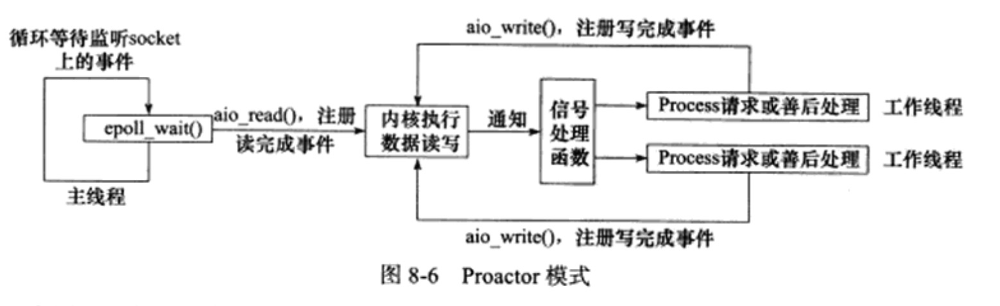

连接socket上的读写事件时通过aio_read/aio_write向内核注册的，因此内核将通过信号来向应用程序报告连接socket上的读写事件，所以，主线程的epoll_wait调用仅能检测监听socket上的连接请求时间，而不能用来检测连接socket上的读写事件

### 模拟Proactor模式

可以使用同步I/O方式来模拟出Proactor模式的一种方法，原理是：**主线程执行数据读写操作，读写完成之后，主线程向工作线程通知这一“完成事件”。那么从工作线程的角度来看，他们就直接获得了数据读写的结果，接下来要做的只是对读写的结果进行逻辑处理**

使用同步I/O模型(epoll_wait为例)模拟出的Proactor模式的工作流程如下：

* 主线程往epoll内核时间表中注册socket上的读就绪事件

* 主线程调用epoll_wait等待socket上有数据可读

* 当socket上有数据可读时，epoll_wait通知主线程，主线程丛socket循环读取数据，直到没有更多数据可读，然后将读取到的数据封装成一个请求对象并插入到请求队列

* 睡眠在请求队列上的某个工作线程被唤醒，它获得请求对象并处理客户请求，然后往epoll内核事件表中注册socket上的写就绪事件

* 主线程调用epoll_wait等待socket可写

* 当socket可写时，epoll_wait通知主线程，主线程往socket上写入服务器处理客户请求的结果

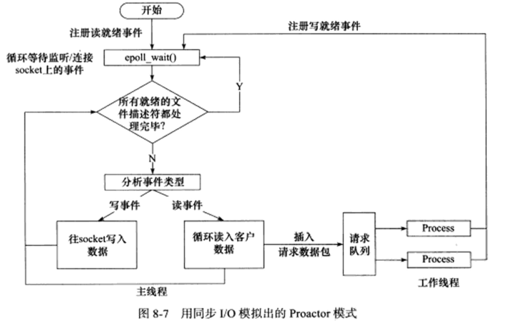

## 两种高效的并发模式

并发编程的目的是**让程序“同时”执行都个任务**。如果程序是计算密集型的，并发编程没有什么又是，反而由于任务的切换使效率降低。但如果程序是I/O密集型的，文件的读写，数据库的访问，则情况不同了。由于I/O操作的速度远没有CPU的计算速度快，所以让程序阻塞于I/O操作将浪费大量的CPU时间，如果程序有多个执行线程，则当前被I/O操作所阻塞的执行线程可以主动放弃CPU，并将执行权转移到其他线程，这样一来，CPU的利用率显著提升。

并发模式是指I/O处理单元和多个逻辑单元之间协调完成任务的方法，服务器主要有两种并发编程模式：

* 半同步／半异步模式
* 领导者／追随者模式

### 半同步／半异步模式

首先，半同步／半异步模式重的“同步”和“异步”与前面讨论的IO模型中的“同步”和“异步”是两种概念。

在IO模型中，“同步”和“异步”区分的是内核向应用程序通知的是何种I/O事件（就绪事件／完成事件），以及该由谁来完成IO读写（应用程序／内核）。

在并发模式中，“同步”指的是程序完全按照代码序列的顺序执行；“异步”指的是程序的执行需要由系用事件来驱动，常见的系统事件包括中断、信号灯

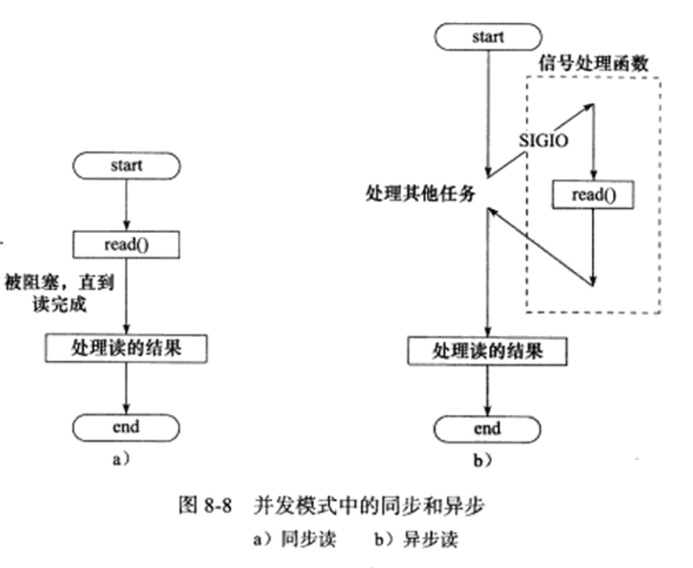

按照同步方式运行的线程称为同步线程，按照异步方式运行的线程称为异步线程。显然异步线程的执行效率高，实时性强。但是编写异步方式执行的程序相对复杂，难于调试和扩展，而且不适合大量的并发，同步线程简单，效率低、实时性差。所以服务器这种既要求比较好的实时性，有用同时处理多个请求的程序，应该同时使用同步线程和异步线程

半同步／半异步模式中，同步线程用于出客户逻辑，相当于逻辑单元，异步线程用于处理I/O事件，相当于I/O处理单元，异步线程监听到客户请求后，就将其封装成请求对象并插入请求队列中，请求队列将通知某个工作在同步模式的工作线程来读取并处理请求对象。具体选择哪个工作线程来为新的客户请求服务，则取决于请求队列的设计。

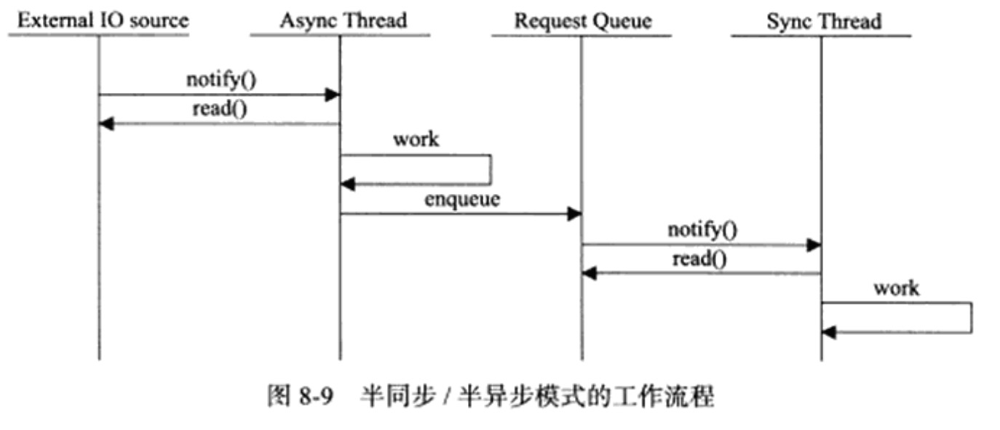

半同步／半异步模式的工作流程模式存在多种变体，有一种变体称为半同步／半反应堆模式

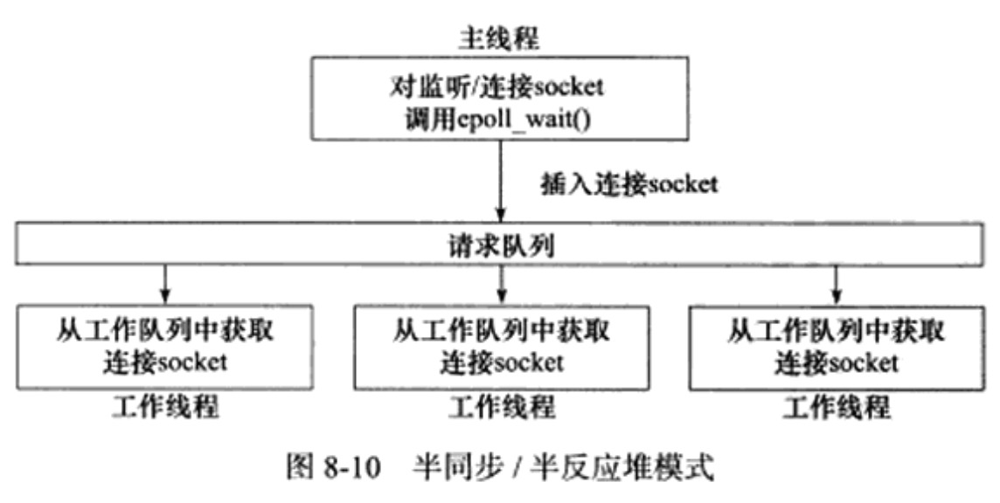

异步线程只有一个，由主线程来充当，他负责监听所有socket上的事件，如果肩痛socket上有可读事件，说明新的连接请求到来，主线程就接受得到新的连接socket，然后往epoll内核事件表中注册该socket的读写事件，如果有读写事件发生，有新的请求／发送数据到客户端，则主线程将该连接socket插入到请求队列中，所有工作线程都睡眠在请求队列上，当有任务到来时，通过竞争／申请互斥锁获得任务的接管权，这种模式是Reactor模式，也可以用Proactor事件处理模式

半同步／半反应堆模式的缺点：

* 主线程和工作线程共享请求队列。主线程往队列中加任务，或者工作线程从队列中取任务，都要加锁，浪费CPU事件

* 每个工作线程在同一时间只能处理同一个请求。容易导致拥塞

相对高效的半同步／半异步模式

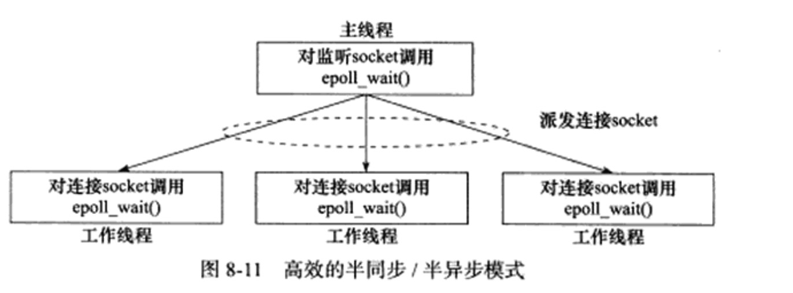

### 领导者／追随者模式

领导者／追随者模式是多个工作线程轮流获得事件源集合，轮流监听、分发并处理事件的一种模式。在任意时间点，程序都仅有一个领导者线程，它负责监听IO事件。而其他线程都是追随者，它们休眠在线程池中等待成为新的领导者。当前的领导者如果检测到IO事件，首先要从线程池中推选出新的领导者线程，然后处理IO事件。此时，新的领导者等待新的IO事件，而原来的领导者则处理IO事件，二者实现了并发

领导者／追随者模式包含如下几个组件：

* 句柄集  HandleSet
* 线程集  ThreadSet
* 事件处理器 EventHandler
* 具体的事件处理器 ConcreteEventHandler

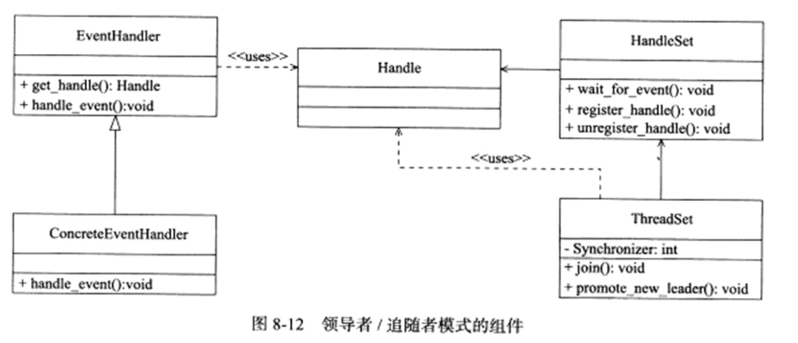

* 句柄集

    句柄用于表示I/O资源，在Linux下通常就是一个文件描述符。句柄集管理众多句柄，使用wait_for_evet方法来监听这些句柄上的IO事件，并将其中的就绪事件通知到领导者线程，领导者则调用绑定到Handle上的事件处理器来处理事件。领导者将Handle和事件处理器绑定是通过register_handle方法实现的
* 线程集

    * Leader，线程当前处于领导者身份，负责等待句柄集上的IO事件
    * Processing，线程正在处理事件。领导者检测到IO事件之后，可以转移到Processing状态来处理该事件，并调用promote_new_leader方法推选新的领导者
    * Follower，调用join方法称为新的领导

* 事件处理器和具体的事件处理器

    事件处理器通常包含一个或多个回调函数handle_event。这些毁掉函数用于处理事件对应的业务逻辑。事件处理器使用前需要被绑定到某个句柄上，当该句柄上有事件发生时，领导者就执行与之绑定的事件处理器中的回调函数。
    
    具体的事件处理器是事件处理器的派生类

    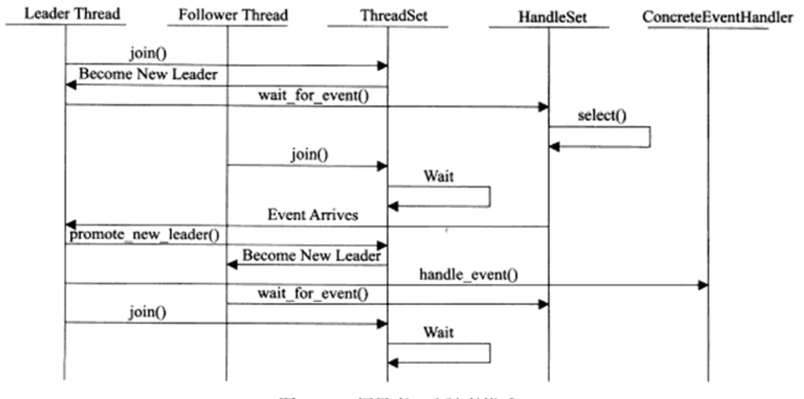


## 有限状态机

本节主要介绍的是逻辑单元内部的一种高效编程方法： 有限状态机

状态独立的有限状态机

```
STATE_MACHINE(Package _pack)
{
    PackageType _type = _pack.GetType();
    switch(_type)
    {
        case type_A:
            process_packageA(_pack);
            break;
        case type_B:
            process_packageA(_pack);
            break;
    }
}
```
上面是一个简单的有限状态机，只不过该状态机的每个状态都是相互独立的，即状态之间没有相互转移。状态之间的转移是需要状态机内部驱动的。

```
STATE_MACHINE()
{
    State cur_State = type_A:
    while(cur_State != type_C)
    {
        Package _pack = getNewPackage();
        switch(cur_State)
        {
            case type_A:
                process_package_stateA(_pack);
                cur_State = type_B;
                break;
            case type_B:
                process_package_stateB(_pack);
                cur_State = type_C;
                break;
        }
    }
}
```

## 提高服务器性能的其他建议

### 池

既然服务器的硬件资源“充裕”，那么提高服务器性能的一个很直接的方法就是已空间换时间，即“浪费”服务器的硬件资源，以换取其运行效率。这就是池的概念。

池是一组资源的集合，这组资源在服务器启动之初就被完全创建好并初始化，这成为静态资源分配。当服务器进入正式运行阶段，即开始处理客户请求的时候，如果他需要相关的资源，就可以直接从池中获取，无需动态分配。当服务器处理完一个客户连接后，可以把相关的资源放回池中，无须执行系统调用来释放资源。最最中的效果来看，池相当于服务器管理系用资源的应用层设施，避免了服务器对内核的频繁访问。

池中的资源分配量为多少？两种

* 第一个是分配足够多的资源，但是容易造成资源的浪费
* 第二个是预先分配一定的资源，此后发现资源不够则再动态分配一些并加入池中

根据不同的资源类型，池可以分为多种，内存池、进程池、线程池和连接池等

进程池和线程池都是并发编程常用的“伎俩”，当我们需要一个工作进程或工作线程来处理新到来的客户请求时，我们可以直接从进程池或线程池中取得一个执行实体，而不需要动态的fork或pthread_create等函数来创建进程／线程

连接池通常用于服务器或服务器机群的内部永久链接，就如前文提到的，如果逻辑单元要频繁的访问本地的某个数据库，那么就可以使用连接池，连接池是服务器预先和数据库程序建立的一组连接的集合，当某个逻辑单元需要访问数据库时，可以直接从连接池中取得一个连接的实体使用，完成访问之后，再还给连接池

### 数据复制

高性能服务器应该避免不必要的数据复制，尤其是当数据复制发生在用户代码和内核之间的时候。如果内核可以直接处理从socket或者文件读入的数据，则应用程序就没必要将这些数据从内核缓冲区复制到应用程序缓冲区。例如ftp服务器，就可以使用零拷贝函数sendfile来直接将其发送给客户端

此外，用户代码内部的数据复制也是要避免的，如果是进程之间要传递大量的数据时，应该考虑用共享内存在他们之间直接共享这些数据，而不是通过管道活着消息队列来传递。

### 上下文切换和锁

并发程序必须考虑上下文切换的问题，即进程切换或线程切换导致的系统开销。即使是I／O密集型的服务器，也不应该使用过多的工作线程，否额则线程的切换将占用大量CPU事件，服务器真正用于处理业务逻辑的CPU时间的比重显得不足了，因此为么个客户连接都创建一个工作线程的服务器模型是不可取的，因此半同步半异步模式是一种比较合理的解决方案。允许一个线程同时处理多个客户端连接。

并发程序需要考虑的另外一个问题是共享资源的加锁保护，锁通常被认为是导致服务器效率低下的一个因素，因为它不仅不处理任何业务逻辑，还需要访问内核资源。服务器有更好的解决方案，就应该避免使用锁。

