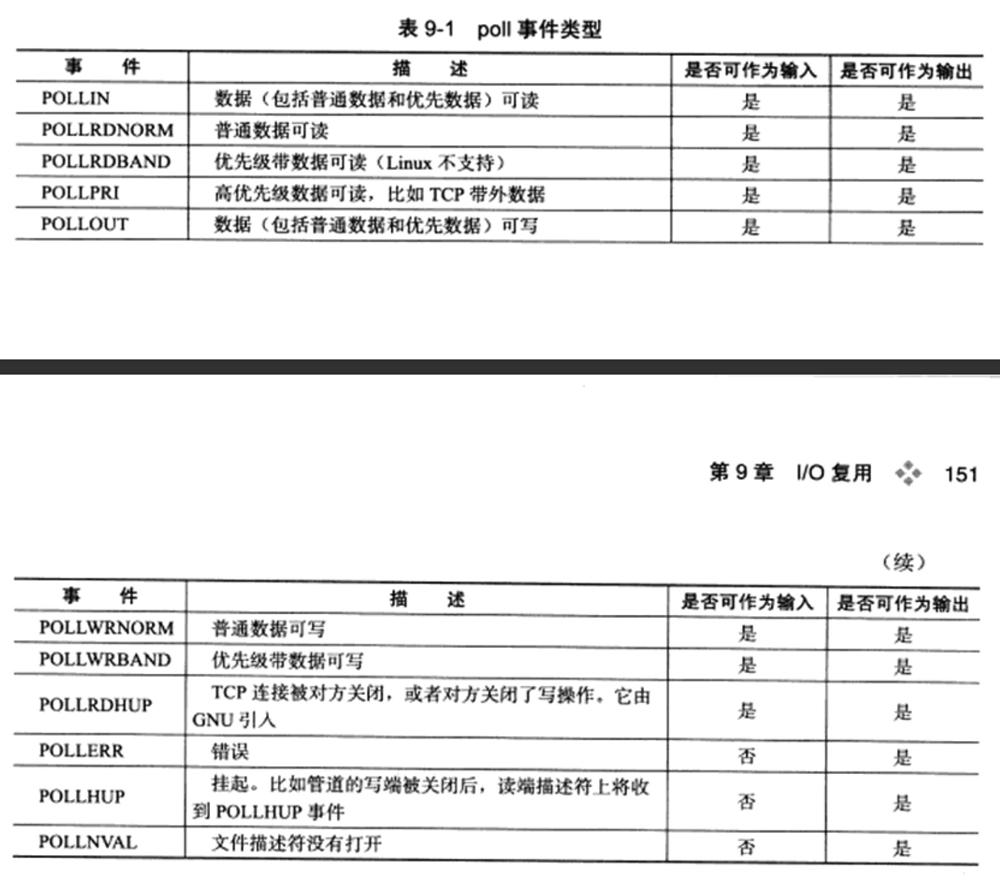

# I/O复用

I/O复用使得程序能同时监听多个文件描述符，这对程序的性能至关重要。通常网络程序在下列情况下需要使用I／O复用技术

* 客户端要同时处理多个socket，本章将要讨论的非阻塞connect技术
* 客户端程序要同时处理用户输入和网络连接，本章要讨论的聊天室程序
* TCP服务器要同时处理监听socket和连接socket
* 服务器要同时处理TCP请求和UDP请求
* 服务器要同时监听多个端口，或者处理多中服务

需要指出的是 IO复用虽然能同时监听多个文件描述符，但是它本身就是阻塞的。并且当多个文件描述符同时就绪时，如果不采取额外的措施，程序就只能按顺序依次处理其中的每个文件描述符，这使得服务器程序看起来像是串行工作的，如果要实现并发，只能使用多进程或多线程等编程手段

 Linux下实现IO复用的系统调用主要是select、poll和epoll

 ## select系统调用

 select系统调用的用途是：在一段时间内，监听用户感兴趣的文件描述符上的可读、可写和异常等时间。
 
 接下来先介绍select系统调用的API，然后再讨论select判断文件描述符就绪的条件，最后给出它在处理带外数据中的应用

 ### select API

 select系统调用的原型如下

 ```
 #include <sys/select.h>
int select(int nfds, fd_set *readfds, fd_set *writefds, fd_set *exceptfds, struct timeval *timeout);
 ```
 
 * nfds参数指定被监听的文件描述符的总数，通常被设置为select监听的所有文件描述符中的最大值加1，因为文件描述符是从0开始计数的

 * readfds、writefds和exceptfds参数分别指向可读、可写和异常等事件对应的文件描述符集合。应用程序调用select函数时，通过这3个参数传入自己感兴趣的文件描述符。select调用返回时，内核将修改它们来通知应用程序哪些文件描述符已经就绪

    `fd_set`结构体仅包含一个整型数组，该数组的每个元素的每一位标记一个文件描述符，所以`fd_set`能容纳的文件描述符数量由FD_SETSIZE制定，这就限制了select能同时处理的文件描述符的总量

    ```
    #include <sys/select.h>
    FD_ZERO(fd_set *fdset); // 清楚fdset的所有位
    FD_SET(int fd, fd_set *fdset); // 设置fdset的位fd
    FD_CLR(int fd, fd_set *fdset); // 清楚fdset的位fd
    int FD_ISSET(int fd, fd_set *fdset); // 测试fdset的位fd是否被设置
    ```

* timeout参数用来设置select函数的超时事件，它是一个timeval结构类型的指针，采用指针参数是因为内核将修改它以告诉应用程序select等待了多久，不能完全信任，因为有时候调用失败时timeout值是不确定的。

    ```
    struct timeval
    {
        long tv_sec; // 秒数
        long tv_usec; // 微秒数
    }
    ```

    如果都传递给0，则立即返回，如果是NULL，则一直阻塞，直到某个文件描述符就绪


select成功时返回就绪文件描述符的总数。如果在超时时间内没有任何描述符就绪，则为0，失败时返回-1并设置errno

### 文件描述符就绪条件

下列情况下socket可读：

* socket内核接收缓存区中的字节数大于或等于其低水位标记SO_RCVLOWAT,此时我们可以无阻塞的读该socket，并且读操作返回的字节数大于0

* socjet通信的对方关闭连接，此时对该socket的读操作返回0

* 监听socket上有新的连接请求

* socket上有未处理得错误，此时我们可以使用getsockopt来读取和清除该错误

下列情况下socket可写

* socket内核发送缓冲区的可用字节数大于等于其低水位标记SO_SNDLOWAT,此时我们可以无阻塞地写该socket，并且写操作返回的字节数大于0

* socket的写操作被关闭，对写操作被关闭的socket执行写操作将触发一个SIGPIPE信号

* socket使用非阻塞connect连接成功或失败之后

* socket上犹未处理的错误，我们可以使用getsockopt来读取和清除该错误

出现异常的情况只有：socket上接收到带外数据

## poll系统调用

poll系统调用和select类似，也是在指定时间内轮询一定数量的文件描述符，以测试其中是否有就绪者，原型如下

```
#include <poll.h>
int poll(struct pollfd* fds, nfds_t nfds, int timeput);
```

* fds参数是一个pollfd结构类型的数组，它指定所有我们感兴趣的文件描述符上发生的可读、可写和异常等事件

    ```
    struct pollfd
    {
        int fd; // 文件描述符
        short events; // 注册的事件
        short revents; // 实际发生的事件，由内核填充
    }
    ```
    events成员告诉poll监听fd上的哪些事件，它是一系列事件的按位或，revents成员则由内核修改，通知应用程序fd上实际发生了哪些事件

    

* nfds 参数指定被监听事件集合fds的大小，其类型nfds_t的定义如下

    `typedef unsigned long int nfds_t`

* timeout参数指定poll的超时值，单位是毫秒，当timeout为-1时，poll调用永远阻塞，直到某个事件发生，当timeout为0时，poll调用将立即返回

## epoll系列系统调用

### 内核事件表

epoll是Linux特有的IO复用函数，它在实现和使用上与select、poll有很大差异。首先，epoll使用一组函数来完成任务，而不是单个函数。其次，epoll把用户关心的文件描述符上的事件放在内核里的一个事件表中，从而无须像select和poll那样每次调用都要重复传入文件描述符集或事件集，但是epoll需要使用一个额外的文件描述符，来唯一标识内核中的这个事件表。

```
#include <sys/epoll.h>
int epoll_create(int size);
```
size参数现在不起作用，只是给内核一个提示，告诉它事件表需要多大，该函数返回的文件描述符将用作其他所有epoll系统调用的第一个参数，以指定要访问的内核事件表

```
#include <sys/epoll.h>
int epoll_ctl(int epfd, int op, int fd, struct epoll_event *event);
```

fd参数是要操作的文件描述符，op参数则指定操作类型，操作类型有如下3种

* `EPOLL_CTL_ADD` 往时间表中注册fd上的事件
* `EPOLL_CTL_MOD` 修改fd上的注册事件
* `EPOLL_CTL_DEL` 删除fd上的注册事件

event参数指定事件，它是epoll_event结构指针类型.`epoll_event`的定义如下

```
struct epoll_event
{
    __uin32_t events; // epoll事件
    epoll_data_t data; // 用户数据
}
```

```
typedef union epoll_data
{
    void *ptr;
    int fd;
    unit32_t u32;
    unit64_t u64
} epoll_data_t;
```

如果要将文件描述符和用户数据关联起来，以实现快读的数据访问，只能使用其他手段，比如放弃使用epoll_data_t的fd成员，而在ptr指向的用户数据包含fd

epoll_ctl成功返回0，失败返回-1并设置errno

### epoll_wait函数

epoll系列系列调用的主要接口是epoll_wait函数。它在一段超时时间内等待一组文件描述符上的事件

```
#include <sys/epoll.h>
int epoll_wait(int epfd, struct epoll_event* events, int maxevents, int timeout);
```

该函数成功时返回就绪的文件描述符的个数，失败时返回-1并设置errno

`epoll_wait`函数如果检测到事件，就将所有就绪的事件从内核事件表中复制到它的第二个参数events指向的数组种，这个数组只用于输出epoll_wait检测到的就绪事件，而不像select和poll的数组参数即用于传入用户注册的事件，又用于输出内核检测到的就绪事件。


```
// poll和epoll在使用上的差别

int ret = poll(fds, MAX_EVENT_NUMBER, -1);
for(int i = 0; i < MAX_EVENT_NUMBER; i++)
{
    if(fds[i].revents & POLLIN)
    {
        int sockfd = fds[i].fd;
        // 处理sockfd
    }
}

// 索引epoll返回的就绪文件描述符
int ret = epoll_wait(epollfd, events, MAX_EVENT_NUMBER, -1);

// 仅遍历就绪的ret个文件描述符
for(int i = 0; i < ret; i++)
{
    int sockfd = events[i].data.fd;
    // 处理sockfd
}
```

### LT和ET模式

epoll对文件描述符的操作有两种模式：LT（电平触发）模式和ET（边沿触发）模式。LT模式是默认的工作模式，这种模式下epoll相当于一个高效率的poll。当往epoll内核时间表中注册一个文件描述符上的EPOLLET事件时，epoll讲以ET模式来操作该文件描述符。ET模式是epoll的高效工作模式。

对于采用LT工作模式的文件描述符，当`epoll_wait`检测到其上有事件发生并将此事件通知应用程序后，应用程序可以不立即处理该事件。这样，当应用程序下次调用epoll_wait时，`epoll_wait`还会再次向应用程序通告此事件，直到该事件被处理，而对于ET工作模式的文件描述符，当`epoll_wait`检测到其上有事件发生并将此事件通知应用程序后，应用程序必须立即处理该事件，因为后续的调用不会再向应用程序通知这一个事件，可见ET模式在很大程度上降低了同一个epoll事件被重复触发的次数。因此效率比LT模式高。


**每个使用ET模式的文件描述符都应该是非阻塞的，如果文件描述符是阻塞的，那么读或写操作将会因为没有后续的事件而一直处于阻塞状态。**

### EPOLLONESHOT事件

即使我们使用ET模式，一个socket上的某个事件还是可能触发多次。这在并发程序中就会引起一个问题。比如一个线程在读取完某个socket上的数据后开始处理这些数据，而在数据的处理过程中该socket又有新数据可读，此时另外一个线程被唤醒来读取这些新的数据，也是就出现了两个线程同时操作一个socket的局面。这不是我们期望的，我们期望的是一个socket连接在任一时刻都只被一个线程处理。这一点可以使用epoll的EPOLLONESHOT事件实现。

对于注册EPOLLONESHOT事件的文件描述符，操作系统最多触发其上注册的一个可读、可写或者异常事件，且只触发一次，触发我们使用`epoll_ctl`函数重置该文件描述符上注册的EPOLLONESHOT事件。这样，当一个线程在处理某个socket时，其他线程是不可能有机会操作该socket的，但是我们注册了EPOLLONESHOT事件的socket一旦被某个线程处理完毕，该线程就应该立即重置这个socket上的EPOLLONESHOT事件，确保这个socket下一次可读时，其EPOLLONESHOT事件能被触发，进而让其他工作线程有机会继续处理这个socket


## 三组IO复用函数的比较

